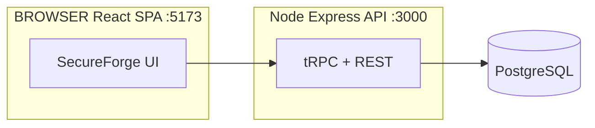

# **SecureForge Web — Web application for OWASP-oriented posture assessment and hardening**

**SecureForge Web** is a **full-stack web system** (React + Node) for **registering web applications**, running **OWASP-aligned checklist assessments**, **automated evidence collection** (HTTP headers, Git repository signals, optional per-user LLM assistance), **findings management**, **dashboards**, and **PDF export**. It targets the **AppHardener** integrator track (applied security): operators work through a browser UI backed by REST/tRPC APIs and PostgreSQL persistence.

**Repository:** [github.com/secureforgeweb/secureforgeweb](https://github.com/secureforgeweb/secureforgeweb)

## Abstract

SecureForge Web supports security analysts and developers who need a **repeatable, demonstrable hardening workflow** for web applications. The application provides **multi-user accounts**, **per-user AI assistant configuration**, an **admin global view** of analyses with comparative charts, a **24-item checklist** across nine categories (seed v1.0), partial-save wizard navigation, and **Entrega 3** consolidated end-to-end flow (registration → analysis → findings → dashboard → PDF). The codebase is a **monorepo slice**: `secureforgeweb_web/` holds the pnpm package (frontend + backend; dual-port dev: API `:3000`, Vite `:5173`).

---

## Table of contents

* [1. README organization](#1-readme-organization)
  * [1.1 Document structure](#11-document-structure)
  * [1.2 Contents of this repository](#12-contents-of-this-repository)
  * [1.3 Repository layout](#13-repository-layout)
* [2. Project context](#2-project-context)
* [3. Basic information](#3-basic-information)
  * [3.1 Introduction](#31-introduction)
  * [3.2 Main capabilities](#32-main-capabilities)
  * [3.3 Architecture](#33-architecture)
  * [3.4 How the stack is run](#34-how-the-stack-is-run)
  * [3.5 Recommended environment](#35-recommended-environment)
* [4. Dependencies](#4-dependencies)
* [5. Security concerns](#5-security-concerns)
* [6. Installation and running locally](#6-installation-and-running-locally)
* [7. Minimal test](#7-minimal-test)
* [8. License](#8-license)
* [Portuguese documentation](#portuguese-documentation)

---

# 1. README organization

## 1.1 Document structure

1. **README organization** — how this file and the repo are structured.
2. **Project context** — academic integrator track and scope.
3. **Basic information** — scope, features, architecture, runtime model.
4. **Dependencies** — Node, pnpm, PostgreSQL, optional Docker.
5. **Security concerns** — secrets, auth, untrusted URLs/repos, LLM keys.
6. **Installation and running locally** — clone, `.env`, database, dev servers.
7. **Minimal test** — quick validation without a full production setup.
8. **License** — terms for this repository.

## 1.2 Contents of this repository

* **`secureforgeweb_web/`** — single **pnpm** package: **React (Vite)** SPA + **Express** API (**tRPC**, **Drizzle**, PostgreSQL).
* **Root metadata** — this `README.md`, minimal root `package.json` (script forwarding), `.gitattributes` (optional LFS for large docs).

Operational detail for developers (routes, env vars, Windows setup) lives in **`secureforgeweb_web/readme-web.md`**. User manuals, delivery reports, and demo scripts are under **`secureforgeweb_web/docs/`** (Portuguese).

## 1.3 Repository layout

```
secureforgeweb/                      ← repository root
├── secureforgeweb_web/              ← main web application (pnpm project root)
│   ├── frontend/                    ← React, Vite, Tailwind, SPA entry
│   ├── backend/                     ← Express, tRPC, Drizzle, services
│   ├── docs/                        ← MANUAL, DEMO, delivery reports, BRAND
│   ├── scripts/                     ← PostgreSQL init, local DB setup (Windows)
│   ├── package.json                 ← scripts: dev, build, test, db:setup, …
│   ├── readme-web.md                ← single package README (operations)
│   ├── docker-compose.yml           ← optional local PostgreSQL 16
│   └── .env                         ← not version-controlled (copy from .env.example)
├── package.json                     ← forwards dev/build/test to secureforgeweb_web/
├── .gitattributes
└── README.md                        ← this file
```

---

# 2. Project context

| Item | Role |
|------|------|
| **AppHardener** | Academic integrator project — web application hardening and posture diagnosis. |
| **SecureForge Web** (this repo) | **Web platform** for OWASP checklist workflows, automated checks, findings, dashboards, PDF export, and optional per-user LLM assistance. |

> **Note:** When assessing **third-party URLs or Git repositories**, treat targets and fetched content as **untrusted**. Run sensitive assessments in isolated environments; never commit secrets or production credentials.

---

# 3. Basic information

## 3.1 Introduction

In development, **Express** serves the API on **`PORT`** (default **3000**) and **Vite** serves the SPA on **5173** with proxy to the API (`VITE_API_PROXY_TARGET`). The browser talks to tRPC at **`/api/trpc`** and REST health at **`/api/health`**.

## 3.2 Main capabilities

* **Applications** — register base URL and/or Git repository; start analyses.
* **OWASP checklist wizard** — 24 items / 9 categories; partial save; HTTP, Git, and AI-assisted evidence per item.
* **Findings & dashboard** — posture metrics, charts, exportable PDF.
* **Per-user AI assistant** — OpenAI, Gemini, Azure, or custom endpoint (`/profile/ai-assistant`); keys stored per user, not in repo `.env`.
* **Administration** — users, checklist items, **global analyses** with comparative benchmark chart.
* **Identity** — local email/password, JWT, RBAC, notifications.

## 3.3 Architecture

| Layer | Responsibility |
|-------|----------------|
| **Browser** | React 19 SPA (Vite 7), TanStack Query, tRPC client, wouter routes. |
| **Node (Express)** | HTTP API, tRPC router, PDF generation, optional OAuth hooks, security middleware. |
| **PostgreSQL** | Persistent state via **Drizzle ORM** (users, applications, analyses, findings, AI config). |
| **External** | Optional LLM APIs (per-user config), HTTP/Git targets under assessment. |



## 3.4 How the stack is run

1. **Development** — `pnpm dev` (from `secureforgeweb_web/` or repo root) runs backend and frontend concurrently.
2. **Production** — `pnpm build` then `pnpm start` (API serves built frontend bundle when configured for production).

## 3.5 Recommended environment

| Layer | Suggestion |
|-------|------------|
| **Host (dev)** | **Windows 10/11**, **Linux**, or **macOS**; **Node.js 22**; **pnpm** via **Corepack**. |
| **RAM** | ≥ **8 GB** for comfortable dev. |
| **Database** | **PostgreSQL 16+** locally, via Docker Compose, or hosted. |
| **Browser** | Recent **Chrome**, **Edge**, or **Firefox**. |

---

# 4. Dependencies

| Dependency | Notes |
|------------|--------|
| **Git** | Clone and update this repository. |
| **Node.js** | **22.x** (see `secureforgeweb_web/package.json`). |
| **Corepack + pnpm** | `corepack enable`; **`pnpm install`** inside **`secureforgeweb_web/`**. |
| **PostgreSQL** | Required (`DATABASE_URL`). |
| **Optional: Docker** | `docker compose up -d` in `secureforgeweb_web/` for local Postgres. |

---

# 5. Security concerns

## 5.1 Main risk vectors

| Vector | Description |
|--------|-------------|
| **Untrusted targets** | Assessed URLs/repos may be malicious or expose sensitive data. |
| **Secrets** | Never commit **`.env`**; keep **`JWT_SECRET`**, DB credentials, and **user LLM keys** out of version control. |
| **AI configuration** | API keys are **per-user** in the database/files under `backend/data/` (gitignored). |
| **Auth** | Use strong `JWT_SECRET` (≥ 32 characters); protect admin routes in production. |

## 5.2 Production-oriented checklist

1. Rotate **`JWT_SECRET`** and database credentials.
2. Serve behind **HTTPS** and a reverse proxy.
3. Restrict network egress if assessments run against untrusted hosts.
4. Do not expose development OAuth bypass or default admin credentials publicly.

## 5.3 Disclaimer

This software is provided **as-is** for **education and authorised security assessment**. The maintainers are **not liable** for misuse or misconfigured deployments. Third-party LLM providers are subject to **their** terms of use.

---

# 6. Installation and running locally

> **Full walkthrough (Portuguese, Windows):** **`secureforgeweb_web/readme-web.md`**.

**Short path** (from repository root):

```bash
corepack enable
cd secureforgeweb_web
```

Copy **`.env.example`** to **`secureforgeweb_web/.env`**, set at least **`DATABASE_URL`** and **`JWT_SECRET`**, then:

```bash
pnpm install
pnpm db:setup
pnpm dev
```

| Service | URL |
|---------|-----|
| **Frontend** | http://localhost:5173 |
| **API (tRPC)** | http://localhost:3000/api/trpc |
| **Health** | http://localhost:3000/api/health |

**Shortcuts from repository root:**

```bash
pnpm dev
pnpm build
pnpm test
pnpm check
pnpm db:setup
```

Run **`pnpm install`** and **`pnpm db:setup`** from **`secureforgeweb_web/`** the first time.

---

# 7. Minimal test

After `pnpm install` and a working `.env` + database:

```bash
cd secureforgeweb_web
pnpm check
pnpm test
```

Optionally run **`pnpm build`** to validate a production build.

---

# 8. License

The application package in **`secureforgeweb_web/`** is licensed under the **MIT License** (see `secureforgeweb_web/package.json`). Dependencies remain under their respective licenses.

---

## Portuguese documentation

This README stays in **English** for international sharing. **Full guides in Portuguese** are maintained inside **`secureforgeweb_web/`**:

| Document | Purpose |
|----------|---------|
| [`secureforgeweb_web/readme-web.md`](secureforgeweb_web/readme-web.md) | Operational README — stack, env, local setup, scripts. |
| [`secureforgeweb_web/docs/MANUAL.md`](secureforgeweb_web/docs/MANUAL.md) | End-user manual. |
| [`secureforgeweb_web/docs/DEMO.md`](secureforgeweb_web/docs/DEMO.md) | Demonstration script (Entrega 3). |
| [`secureforgeweb_web/docs/README.md`](secureforgeweb_web/docs/README.md) | Documentation index. |
| [`secureforgeweb_web/docs/RELATORIO.md`](secureforgeweb_web/docs/RELATORIO.md) | Current delivery report. |

Prefer updating the files above when operational details change.
