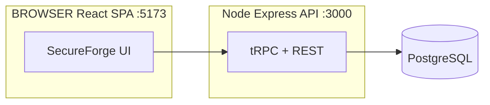

# SecureForge Web

**Web platform for OWASP-oriented security posture assessment and guided hardening.**

Register web applications, run checklist assessments, collect automated evidence (HTTP headers, Git repository signals, optional per-user LLM), manage findings, track posture over time, and export PDF reports.

| Resource | Link |
|----------|------|
| **Source code** | [github.com/secureforgeweb/secureforgeweb](https://github.com/secureforgeweb/secureforgeweb) |
| **Demo videos** | [Google Drive — demonstração](https://drive.google.com/drive/folders/1oJRC9_3Zjx5ahBdgdXSajCKXhYjytKWX?usp=drive_link) |
| **User manual (PT)** | [`secureforgeweb_web/docs/MANUAL.md`](secureforgeweb_web/docs/MANUAL.md) |
| **Architecture (PT)** | [`secureforgeweb_web/docs/PROJETO_ARQUITETURAL.md`](secureforgeweb_web/docs/PROJETO_ARQUITETURAL.md) |
| **Screenshots** | [`secureforgeweb_web/docs/screenshots/`](secureforgeweb_web/docs/screenshots/) |
| **Ops guide (PT)** | [`secureforgeweb_web/readme-web.md`](secureforgeweb_web/readme-web.md) |
| **License** | [MIT](LICENSE) |

**SBSeg 2026 — Salão de Ferramentas:** modality **Código Aberto** (public source + documentation + technical video). Call: [sbseg2026.uff.br/chamadas/sf](https://www.sbseg2026.uff.br/chamadas/sf/).

---

## Table of contents

1. [Quick start](#quick-start)
2. [What it does](#what-it-does)
3. [Architecture](#architecture)
4. [Repository layout](#repository-layout)
5. [Dependencies](#dependencies)
6. [Security notes](#security-notes)
7. [Installation](#installation)
8. [Minimal test](#minimal-test)
9. [Documentation map](#documentation-map)
10. [License](#license)

---

## Quick start

```bash
git clone https://github.com/secureforgeweb/secureforgeweb.git
cd secureforgeweb/secureforgeweb_web
cp .env.example .env   # set DATABASE_URL and JWT_SECRET (≥ 32 chars)
pnpm install
pnpm db:setup          # migrate + seed Essential v1.0 + import ASVS 5.0
pnpm dev
```

| Service | URL |
|---------|-----|
| Frontend | http://localhost:5173 |
| API (tRPC) | http://localhost:3000/api/trpc |
| Health | http://localhost:3000/api/health |

From the repository root you can also run `pnpm dev`, `pnpm build`, `pnpm test`, and `pnpm db:setup` (they forward into `secureforgeweb_web/`).

**pnpm on Windows:** `corepack enable` usually needs an **Administrator** terminal. Alternatives: `npm install -g pnpm` or the [pnpm installer](https://pnpm.io/installation).

Full Portuguese walkthrough (env vars, HTTPS demo, ASVS sync): [`secureforgeweb_web/readme-web.md`](secureforgeweb_web/readme-web.md).

---

## What it does

* **Applications** — register base URL and/or Git repository; start analyses with checklist selection.
* **Checklist catalogs** — **Essential SecureForge v1.0** (24 items / 9 categories) plus **OWASP ASVS 5.0** (Level 1 and Complete) imported from the official flat JSON; admin **Sync ASVS** to refresh.
* **Wizard** — partial save; HTTP, Git, and optional AI-assisted suggestions per item; human confirmation before save.
* **Findings & dashboard** — severity, priority, posture score, charts, PDF export.
* **Per-user AI assistant** — OpenAI, Gemini, Azure, or custom endpoint; keys stored per user (not in repo `.env`).
* **Administration** — users, checklist items, global analyses with filters and comparative charts.
* **i18n** — Portuguese / English UI; API messages follow `x-locale`.

Academic context: **AppHardener** integrator track (applied security / web hardening).

> When assessing **third-party URLs or Git repositories**, treat targets as **untrusted**. Never commit secrets or production credentials.

---

## Architecture

| Layer | Responsibility |
|-------|----------------|
| **Browser** | React 19 SPA (Vite 7), TanStack Query, tRPC client, wouter |
| **Node (Express)** | HTTP API, tRPC, PDF generation, HTTP/Git/LLM assessors (in-process) |
| **PostgreSQL** | Persistence via Drizzle ORM |
| **External** | Assessed HTTP/Git targets; optional LLM APIs |


```mermaid
flowchart LR
  subgraph browser[BROWSER React SPA :5173]
    UI[SecureForge UI]
  end
  subgraph node[Node Express API :3000]
    API[tRPC + REST]
  end
  DB[(PostgreSQL)]
  UI --> API
  API --> DB
```

**Runtime:** development uses dual ports (API `:3000`, Vite `:5173` with proxy). Production: `pnpm build` then `pnpm start`.

---

## Repository layout

```
secureforgeweb/
├── LICENSE                          ← MIT
├── README.md                        ← this file (EN)
├── package.json                     ← forwards scripts to secureforgeweb_web/
└── secureforgeweb_web/              ← main pnpm package
    ├── frontend/                    ← React / Vite SPA
    ├── backend/                     ← Express, tRPC, Drizzle, assessors
    ├── docs/
    │   ├── MANUAL.md
    │   ├── PROJETO_ARQUITETURAL.md
    │   ├── README.md                ← docs index + demo video link
    │   └── screenshots/
    ├── scripts/                     ← DB / HTTPS helpers
    ├── readme-web.md                ← operational README (PT)
    ├── docker-compose.yml           ← optional PostgreSQL 16
    └── .env.example
```

Other files under `docs/` (drafts, Overleaf, local PDFs) are **gitignored** and stay on the authors’ machines only.

---

## Dependencies

| Dependency | Notes |
|------------|--------|
| **Git** | Clone this repository |
| **Node.js 22.x** | See `secureforgeweb_web/package.json` |
| **pnpm** | Via Corepack or standalone install |
| **PostgreSQL 16+** | Required (`DATABASE_URL`) |
| **Docker** (optional) | `docker compose up -d` in `secureforgeweb_web/` |

Recommended: ≥ 8 GB RAM; recent Chrome, Edge, or Firefox.

---

## Security notes

| Vector | Guidance |
|--------|----------|
| Untrusted targets | Assessed URLs/repos may be malicious — isolate when needed |
| Secrets | Never commit `.env`; protect `JWT_SECRET`, DB credentials, LLM keys |
| AI keys | Per-user in DB / gitignored data paths |
| Production | Strong `JWT_SECRET` (≥ 32 chars); HTTPS; no default admin creds |

Local HTTPS demo (headers / self-assessment): in `secureforgeweb_web/`, run `pnpm https:setup`, set `VITE_DEV_HTTPS=1`, `ENABLE_SECURE_HEADERS=1`, and cert paths. For HEADER-\* / DATA-01, prefer app URL **`https://localhost:3000`**.

**Disclaimer:** provided as-is for education and authorised assessment. Third-party LLM providers remain under their own terms.

---

## Installation

1. Install **Node.js 22** and enable **pnpm** (see [Quick start](#quick-start)).
2. Copy `secureforgeweb_web/.env.example` → `secureforgeweb_web/.env`.
3. Set at least `DATABASE_URL` and `JWT_SECRET`.
4. From `secureforgeweb_web/`: `pnpm install` → `pnpm db:setup` → `pnpm dev`.

Optional ASVS maintenance:

```bash
pnpm db:import-asvs   # first import (L1 + Complete)
pnpm db:sync-asvs     # refresh from OWASP (also available in admin UI)
```

---

## Minimal test

```bash
cd secureforgeweb_web
pnpm check
pnpm test
# optional: pnpm build
```

---

## Documentation map

| Document | Language | Purpose |
|----------|----------|---------|
| This `README.md` | EN | Public project entry for GitHub / SBSeg reviewers |
| [`secureforgeweb_web/readme-web.md`](secureforgeweb_web/readme-web.md) | PT | Env, scripts, Windows/HTTPS ops |
| [`secureforgeweb_web/docs/MANUAL.md`](secureforgeweb_web/docs/MANUAL.md) | PT | End-user manual |
| [`secureforgeweb_web/docs/PROJETO_ARQUITETURAL.md`](secureforgeweb_web/docs/PROJETO_ARQUITETURAL.md) | PT | Architecture & requirements |
| [`secureforgeweb_web/docs/README.md`](secureforgeweb_web/docs/README.md) | PT | Docs index + **demo video Drive folder** |
| [Demo videos (Drive)](https://drive.google.com/drive/folders/1oJRC9_3Zjx5ahBdgdXSajCKXhYjytKWX?usp=drive_link) | — | Installation and feature walkthrough videos |

---

## License

[MIT](LICENSE) — see also `license` in `secureforgeweb_web/package.json`. Dependencies remain under their respective licenses.
