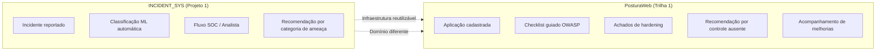
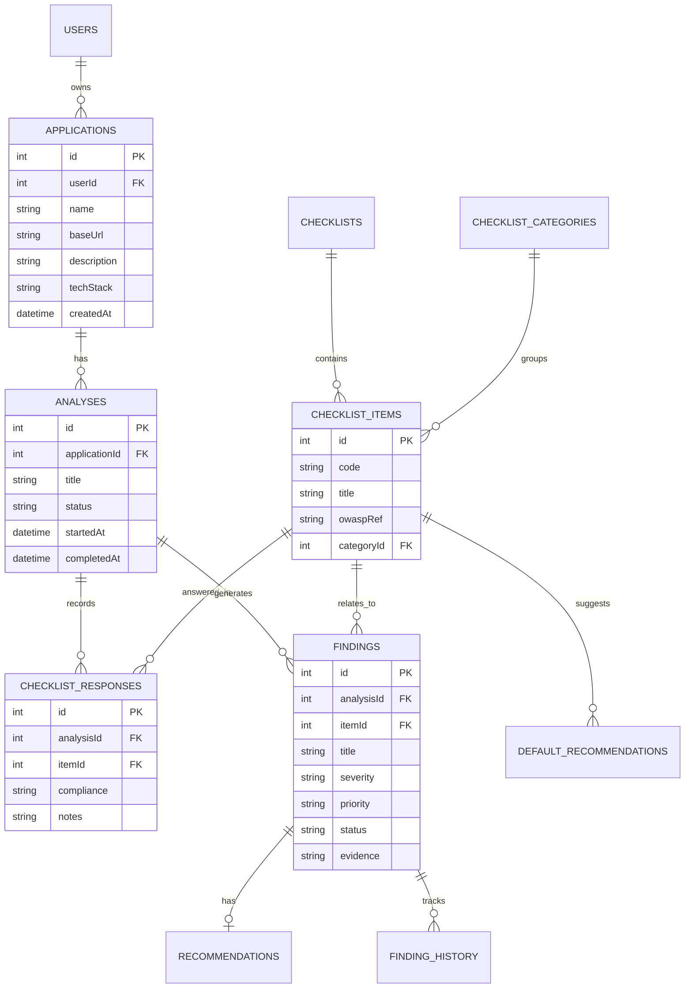
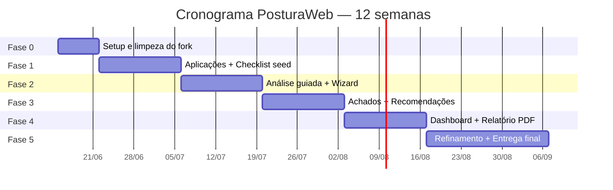

# Guia de Implementação — SecureForge Web

**Disciplina:** Projeto Integrador — Desenvolvimento de Ferramentas de Segurança Aplicada  
**Trilha:** 1 — AppHardener  
**Projeto base de referência:** [incident_security_system](https://github.com/margefson/incident_security_system) (Projeto 1)  
**Versão:** 1.2  
**Data:** 30/06/2026

---

## Estado atual do sistema (referência rápida)

> Este guia documenta o **cronograma histórico** de implementação. Para o **estado operacional atual (Entrega 3)**, consulte [RELATORIO_ENTREGA_3.md](RELATORIO_ENTREGA_3.md), [MANUAL.md](MANUAL.md) e [DEMO.md](DEMO.md).

| Capacidade | Status |
|---|---|
| Fluxo principal ponta a ponta | Concluído |
| Cadastro de aplicações (URL e/ou repo Git) | Concluído |
| Checklist OWASP v1.0 (24 itens) | Concluído |
| Wizard com salvamento parcial | Concluído |
| Análises automáticas (HTTP, Git, IA) | Concluído |
| Assistente IA **por usuário** (perfil) | Concluído — Entrega 3 |
| Admin — análises globais + benchmark | Concluído — Entrega 3 |
| Achados, dashboard, PDF | Concluído |
| Admin (usuários, checklist) | Concluído |
| Migrações Drizzle | `0000`–`0016` |

**Comandos:** `pnpm db:setup` · `pnpm dev` · `pnpm test` · `pnpm check`

**Demonstração:** [DEMO.md](DEMO.md) · **Relatório:** [RELATORIO_ENTREGA_3.md](RELATORIO_ENTREGA_3.md)

---

## 1. Nome do sistema

### Nome do sistema: **SecureForge Web**

| Aspecto | Definição |
|---|---|
| **Nome comercial / tema** | **PosturaWeb** — *Plataforma de Diagnóstico e Hardening de Aplicações Web* |
| **Codinome acadêmico** | **AppHardener** (nome oficial da Trilha 1 no AVA) |
| **Sigla técnica** | `POSTURA_WEB` ou `PWEB` |

### Por que PosturaWeb?

- Reflete o propósito central: **avaliar e melhorar a postura de segurança** de aplicações web.
- É claro para o público-alvo (equipes pequenas, laboratórios, AppSec iniciantes).
- Diferencia-se do projeto anterior (**INCIDENT_SYS**), que trata de **incidentes reativos**, enquanto PosturaWeb é **proativo e orientado à correção**.
- Funciona bem em apresentações acadêmicas e em possível submissão ao Salão de Ferramentas do SBSeg.

### Alternativas consideradas

| Nome | Prós | Contras |
|---|---|---|
| **WebFortify** | Internacional, remete a fortalecimento | Menos específico sobre diagnóstico |
| **HardenPath** | Enfatiza jornada de melhoria | Nome em inglês, menos intuitivo em PT |
| **AppShield Review** | Combina proteção + revisão | Genérico, parece produto comercial |
| **AppHardener** | Nome oficial da trilha | Soa técnico demais para usuário final |

> **Decisão sugerida:** usar **PosturaWeb** na interface, documentação e apresentação; citar **AppHardener / Trilha 1** nos documentos acadêmicos e relatórios da disciplina.

---

## 2. Visão comparativa: Projeto 1 × PosturaWeb



| Dimensão | INCIDENT_SYS (Projeto 1) | PosturaWeb (Trilha 1) |
|---|---|---|
| **Problema** | Registrar e classificar incidentes de segurança | Diagnosticar e fortalecer aplicações web |
| **Objeto central** | Incidente (`incidents`) | Aplicação + Análise + Achado |
| **Entrada de dados** | Título + descrição livre do incidente | Checklist estruturado por controles |
| **Classificação** | ML automático (TF-IDF + Naive Bayes) | Avaliação manual/guiada (conforme / não conforme) |
| **Severidade** | `risk_level` derivado da categoria ML | `severidade` + `prioridade` definidas pelo analista |
| **Recomendações** | Mapa estático por categoria de ameaça | Catálogo por item de checklist / achado |
| **Status** | open → in_progress → resolved | aberto → em_correção → resolvido |
| **Relatório** | PDF de incidentes por categoria/risco | PDF de postura de segurança da aplicação |
| **Papel do analista** | Triagem SOC de incidentes | Revisão AppSec de aplicações |
| **ML / Python** | Obrigatório (classificador + PDF Flask) | **Não necessário** (fora do escopo da trilha) |

---

## 3. Inventário do Projeto 1 — O que já existe

Referência clonada em: `_ref/incident_security_system/`

### 3.1 Infraestrutura reaproveitável (alta aderência)

| Componente | Localização no Projeto 1 | Reaproveitamento no PosturaWeb |
|---|---|---|
| **Monorepo pnpm** | `package.json`, `tsconfig.json` | Estrutura `frontend/` + `backend/` |
| **Express + tRPC 11** | `backend/src/_core/`, `controllers/` | Mesma base de API type-safe |
| **React 19 + Vite 7** | `frontend/` | SPA com HMR |
| **Tailwind 4 + shadcn/ui** | `frontend/src/components/ui/` | Design system (~50 componentes) |
| **Drizzle ORM + PostgreSQL** | `backend/drizzle/` | Migrações e queries |
| **Autenticação JWT** | `sdk.ts`, `cookies.ts`, router `auth` | Login, registro, sessão HttpOnly |
| **Hash bcrypt (custo 12)** | `auth` router | Proteção de senhas |
| **RBAC (3 papéis)** | `user`, `security-analyst`, `admin` | Adaptar papéis para AppSec |
| **Middleware de segurança** | `middleware/security.ts` | Helmet, CORS, rate limit |
| **Proteção IDOR** | `incidents.getById` (404 em vez de 403) | Mesmo padrão para aplicações/achados |
| **Validação Joi + Zod** | `lib/validation.ts`, inputs tRPC | Formulários e API |
| **Dashboard com Recharts** | `Dashboard.tsx`, `RiskAnalysis.tsx` | Gráficos de severidade e progresso |
| **Layout operacional** | `DashboardLayout.tsx` | Sidebar, header, navegação por papel |
| **CRUD de categorias** | `categories` router + `AdminCategories.tsx` | Base para categorias de checklist |
| **Rastreamento de status** | `incident_status` enum + `updateStatus` | Fluxo de achados (aberto → resolvido) |
| **Histórico de alterações** | `incident_history` + timeline UI | Histórico de achados e análises |
| **Notificações in-app** | `notifications` + `NotificationBell.tsx` | Alertas de achados críticos (opcional) |
| **Exportação PDF** | `services/pdf.ts` (PDFKit Node) | Relatório de postura (adaptar template) |
| **Exportação CSV** | `analytics.exportHistoryCsv` | Exportar achados/histórico |
| **Testes Vitest** | `backend/src/tests/` (~1100 testes) | Padrão de suites por domínio |
| **Docker Compose** | `docker-compose.yml` (PostgreSQL 16) | Ambiente local reproduzível |
| **Reset de senha** | `password_reset_tokens` + email | Fluxo completo reutilizável |

### 3.2 Padrões reaproveitáveis com adaptação (média aderência)

| Padrão no Projeto 1 | Adaptação para PosturaWeb |
|---|---|
| `incidents` (CRUD + listagem + busca) | → `applications` + `findings` (achados) |
| `incidents.stats` + gráficos | → `analyses.dashboard` (score de postura) |
| `CATEGORY_RECOMMENDATIONS` (mapa estático) | → `CHECKLIST_RECOMMENDATIONS` por item OWASP |
| `categories` (tabela admin) | → `checklist_categories` (Autenticação, Headers, etc.) |
| `RiskAnalysis.tsx` | → `PostureAnalysis.tsx` (recomendações de hardening) |
| `NewIncident.tsx` (formulário) | → `NewAnalysis.tsx` (wizard de checklist) |
| `IncidentDetail.tsx` | → `FindingDetail.tsx` (achado + recomendação + status) |
| `AdminIncidents.tsx` | → `AdminFindings.tsx` (visão global, se necessário) |
| Papel `security-analyst` | → `security-analyst` ou `appsec-reviewer` (revisor de aplicações) |

### 3.3 O que NÃO deve ser reaproveitado (específico de incidentes)

| Componente | Motivo da exclusão |
|---|---|
| **Pipeline ML** (`backend/ml/`, Flask :5001) | Trilha 1 não exige scanner/ML; checklist é guiado |
| **Treinamento ML** (`AdminML.tsx`, `AdminMLTraining.tsx`) | Domínio de classificação de ameaças, não hardening |
| **SIEM / Wazuh** (`integrations/siem/`) | Integração de incidentes em tempo real |
| **Tabela `incidents`** | Entidade de domínio diferente |
| **Enum `incident_category`** | Taxonomia de ameaças (phishing, malware…) ≠ controles OWASP |
| **Campo `confidence` (ML)** | Não aplicável a avaliação manual |
| **Fluxo analista SOC** (`AnalystDashboard`, fila de incidentes) | Workflow reativo de SOC |
| **Classificação automática** (`incidents.create` + ML) | Substituído por checklist guiado |
| **Saúde do Sistema Flask** (`AdminSystemHealth.tsx`) | Dependência de serviços Python |
| **Landing page INCIDENT_SYS** (`Home.tsx`) | Reposicionar para hardening de apps |
| **Reclassificação ML / unknowns** | Não aplicável |

---

## 4. Matriz de requisitos — Status de implementação

Legenda: ✅ Existe no P1 (reaproveitável) · 🔄 Existe parcialmente · ❌ A desenvolver

| ID | Requisito PosturaWeb (Trilha 1) | Status | Origem / Ação |
|---|---|---|---|
| RF01 | Cadastro de aplicação/projeto | ❌ | Novo: tabela `applications`, CRUD, tela de cadastro |
| RF02 | Checklist/formulário de análise | ❌ | Novo: tabelas `checklists`, `checklist_items`, `checklist_responses`, wizard UI |
| RF03 | Registro de achados | 🔄 | Adaptar padrão de `incidents` → `findings` |
| RF04 | Severidade ou prioridade | 🔄 | Reaproveitar enums `risk_level` renomeados + campo `priority` |
| RF05 | Recomendação de correção | 🔄 | Evoluir `CATEGORY_RECOMMENDATIONS` → catálogo por item de checklist |
| RF06 | Visualização consolidada | 🔄 | Adaptar `Dashboard.tsx` + `RiskAnalysis.tsx` |
| RF07 | Relatório simples | ✅ | Adaptar `reports.exportPdf` + template PDF |
| RF08 | Acompanhamento de progresso | ✅ | Reaproveitar `updateStatus` + `resolvedAt` |
| RF09 | Histórico de análises | 🔄 | Novo: tabela `analyses` + histórico por aplicação |
| RF10 | Catálogo de controles OWASP | ❌ | Novo: seed com ~30–40 itens em 9 categorias |
| RF11 | Filtros e busca | ✅ | Reaproveitar padrão de `incidents.search` |
| RF12 | Gestão de usuários | ✅ | Reaproveitar `auth` + `admin` routers |

### Estimativa de esforço por área

| Área | % já pronto (base P1) | % a desenvolver |
|---|---|---|
| Infraestrutura (auth, segurança, build, Docker) | ~85% | ~15% (renomear, limpar ML) |
| Frontend (layout, componentes, tema) | ~60% | ~40% (novas telas de domínio) |
| Backend (API, validação, testes) | ~50% | ~50% (novos routers e regras) |
| Banco de dados (schema) | ~25% | ~75% (novo modelo de domínio) |
| Relatórios PDF | ~70% | ~30% (novo template de postura) |
| ML / Python | 0% reaproveitado | Remover dependência |

---

## 5. Modelo de domínio alvo (novo)

O Projeto 1 possui 7 tabelas centradas em incidentes. O PosturaWeb precisa de um modelo orientado a **aplicação → análise → checklist → achado**.



### Mapeamento Projeto 1 → PosturaWeb

| Projeto 1 | PosturaWeb | Tipo de migração |
|---|---|---|
| `users` | `users` | Manter (ajustar papéis se necessário) |
| `incidents` | `findings` | **Substituir** — campos diferentes |
| `categories` | `checklist_categories` | **Renomear e reseed** |
| `incident_history` | `finding_history` | **Adaptar** FK e ações |
| `incident_category` enum | `checklist_item` + `compliance` enum | **Descartar** enum de ameaças |
| `risk_level` enum | `severity` enum | **Renomear** (mesmos valores) |
| `incident_status` enum | `finding_status` enum | **Renomear** |
| — | `applications` | **Criar** |
| — | `analyses` | **Criar** |
| — | `checklists` / `checklist_items` | **Criar** |
| — | `checklist_responses` | **Criar** |
| — | `default_recommendations` | **Criar** |
| `notifications` | `notifications` | Manter (opcional) |
| `password_reset_tokens` | `password_reset_tokens` | Manter |

---

## 6. Estratégia de implementação

### 6.1 Abordagem recomendada: **Fork adaptativo**

Não construir do zero. Partir do `incident_security_system` como template e executar uma **migração de domínio** em fases:

```
incident_security_system  →  fork  →  posturaweb
                                      ├── Remover ML/Python/SIEM
                                      ├── Renomear projeto e branding
                                      ├── Novo schema (applications, analyses, findings)
                                      ├── Novos routers tRPC
                                      └── Novas views React
```

### 6.2 O que fazer no Dia 1 (setup)

1. Copiar/forkar o repositório para `trilha1/` (ou novo repo `posturaweb`).
2. Remover pastas: `backend/ml/`, `integrations/siem/`, views `AdminML*`, `Analyst*`.
3. Renomear em `package.json`, `README.md`, títulos e `Home.tsx` → **PosturaWeb**.
4. Atualizar `.env.example` e `docker-compose.yml` (DB: `posturaweb`).
5. Manter: auth, security middleware, layout, componentes UI, PDF service, Vitest.

### 6.3 Papéis sugeridos para equipe (até 4 integrantes)

| Papel | Responsabilidades |
|---|---|
| **Backend / API** | Schema Drizzle, routers `applications`, `analyses`, `findings`, seed checklist, testes |
| **Frontend** | Telas de cadastro, wizard checklist, painel de achados, dashboard |
| **Dados / Domínio** | Catálogo OWASP, recomendações padrão, regras de severidade, relatório |
| **Integração / QA** | Docker, migrações, testes E2E, documentação, apresentação |

---

## 7. Fases de desenvolvimento — Passo a passo

### Fase 0 — Preparação e limpeza (Semana 1)

**Objetivo:** Repositório PosturaWeb funcional sem dependências de incidentes/ML.

| # | Tarefa | Entregável | Depende de |
|---|---|---|---|
| 0.1 | Fork/cópia do `incident_security_system` | Repo `posturaweb` inicializado | — |
| 0.2 | Remover ML, SIEM, Flask, views analista/ML | Build sem Python | 0.1 |
| 0.3 | Rebrand: PosturaWeb (nome, logo placeholder, Home) | Identidade visual básica | 0.1 |
| 0.4 | Atualizar Docker e `.env` para novo banco | `docker compose up` OK | 0.1 |
| 0.5 | Documentar decisões neste guia + arquitetura | `docs/` atualizado | — |

**Critério de aceite:** `pnpm dev` sobe frontend + backend; login/registro funcionam; sem referências a incidentes na navegação principal.

> **Status Fase 0:** Concluída em 15/06/2026. Repositório `posturaweb` inicializado a partir do `incident_security_system`.

---

### Fase 1 — Fundação: Aplicações e Checklist Seed (Semanas 2–3)

**Objetivo:** RF01 + base do RF02.

| # | Tarefa | Entregável |
|---|---|---|
| 1.1 | Criar tabelas `applications`, `checklist_categories`, `checklists`, `checklist_items` | Migração Drizzle |
| 1.2 | Script seed: checklist v1.0 (~35 itens, 9 categorias OWASP) | `scripts/seed_checklist.mjs` |
| 1.3 | Router `applications` (CRUD) com isolamento por usuário | tRPC `applications.*` |
| 1.4 | Tela lista + formulário de cadastro de aplicação | `/applications`, `/applications/new` |
| 1.5 | Tela detalhe da aplicação (metadados + botão "Nova análise") | `/applications/:id` |
| 1.6 | Testes: CRUD aplicação, IDOR, validação | `applications.test.ts` |

**Critério de aceite:** Usuário cadastra aplicação com nome, URL, stack e descrição; checklist seed visível via API.

> **Status Fase 1:** Concluída em 15/06/2026. PostgreSQL configurado, CRUD de aplicações, seed checklist v1.0 (24 itens).

---

### Fase 2 — Análise guiada e Checklist (Semanas 4–5)

**Objetivo:** RF02 completo + início do RF03.

| # | Tarefa | Entregável |
|---|---|---|
| 2.1 | Tabelas `analyses`, `checklist_responses` | Migração Drizzle |
| 2.2 | Router `analyses` (criar, obter, salvar respostas) | tRPC `analyses.*` |
| 2.3 | Regra: item `NAO_CONFORME` / `PARCIAL` → sugerir achado | Lógica em `analyses.saveResponses` |
| 2.4 | Wizard de checklist por categoria (barra de progresso) | `/analyses/:id/checklist` |
| 2.5 | Enum `compliance`: CONFORME, PARCIAL, NAO_CONFORME, NAO_APLICAVEL | Schema + UI |
| 2.6 | Testes: fluxo de análise, respostas, geração sugerida de achado | `analyses.test.ts` |

**Critério de aceite:** Usuário inicia análise, percorre checklist por categorias, salva respostas com observações.

> **Status Fase 2:** Concluída em 15/06/2026. Tabelas `analyses` e `checklist_responses`, router `analyses.*`, wizard `/analyses/:id/checklist`, sugestão de achados em respostas não conformes.

---

### Fase 3 — Achados, severidade e recomendações (Semanas 6–7)

**Objetivo:** RF03, RF04, RF05, RF08.

| # | Tarefa | Entregável |
|---|---|---|
| 3.1 | Tabelas `findings`, `default_recommendations`, `finding_history` | Migração Drizzle |
| 3.2 | Router `findings` (CRUD, status, notas) | tRPC `findings.*` |
| 3.3 | Catálogo `default_recommendations` por `checklist_item` | Seed ou JSON em `shared/` |
| 3.4 | Auto-preenchimento de severidade/prioridade a partir do item | Regra de domínio |
| 3.5 | Tela lista de achados com filtros (severidade, status, categoria) | `/applications/:id/findings` |
| 3.6 | Tela detalhe do achado (recomendação, evidência, histórico) | `/findings/:id` |
| 3.7 | Fluxo de status: aberto → em_correção → resolvido | Adaptar `updateStatus` do P1 |
| 3.8 | Testes: achados, recomendações, histórico, IDOR | `findings.test.ts` |

**Critério de aceite:** Achado criado manualmente ou a partir de item não conforme; recomendação exibida; status atualizável com histórico.

> **Status Fase 3:** Concluída em 16/06/2026. Tabelas `findings` e `finding_history`, router `findings.*`, geração automática ao concluir análise, telas `/applications/:id/findings` e `/findings/:id`.

---

### Fase 4 — Dashboard e relatório (Semanas 8–9)

**Objetivo:** RF06, RF07, RF09.

| # | Tarefa | Entregável |
|---|---|---|
| 4.1 | Endpoint `analyses.dashboard` (score, severidades, progresso) | KPIs calculados |
| 4.2 | Dashboard principal por aplicação | `/applications/:id/dashboard` |
| 4.3 | Dashboard global do usuário (todas as aplicações) | `/dashboard` adaptado |
| 4.4 | Gráficos: achados por severidade, por categoria, taxa de resolução | Recharts |
| 4.5 | Adaptar `reports.exportPdf` → relatório de postura | PDF com score + achados + plano de ação |
| 4.6 | Histórico de análises da mesma aplicação | Lista em `/applications/:id` |
| 4.7 | Testes: métricas, exportação PDF | `reports.test.ts`, `dashboard.test.ts` |

**Critério de aceite:** Dashboard exibe score de postura; PDF exportável com resumo executivo e recomendações priorizadas.

> **Status Fase 4:** Concluída em 16/06/2026. Endpoints `analyses.dashboard`, `analyses.globalDashboard`, `reports.exportPdf`, telas `/dashboard`, `/applications/:id/dashboard`, gráficos Recharts e PDF de postura.

---

### Fase 5 — Refinamento, segurança e entrega final (Semanas 10–12)

**Objetivo:** Qualidade, documentação, apresentação.

| # | Tarefa | Entregável |
|---|---|---|
| 5.1 | Revisar requisitos de segurança (8 itens do P1 ainda aplicáveis) | `security.test.ts` verde |
| 5.2 | Admin: gestão de itens de checklist (opcional) | `/admin/checklist-items` |
| 5.3 | Notificações para achados críticos (opcional) | Reaproveitar `NotificationBell` |
| 5.4 | Landing page e texto alinhados à Trilha 1 | `Home.tsx` |
| 5.5 | README PosturaWeb + manual de uso | `docs/MANUAL.md` |
| 5.6 | Roteiro de demonstração (app de laboratório) | `docs/DEMO.md` |
| 5.7 | Apresentação final + vídeo demo | Slides / gravação |

**Critério de aceite:** Protótipo demonstrável ponta a ponta; documentação completa; testes passando.

> **Status Fase 5:** Concluída em 16/06/2026. `security.test.ts` adaptado, admin checklist, notificações de achados críticos, `MANUAL.md`, `DEMO.md`, `APRESENTACAO.md`, limpeza de docs legados.

---

### Fase 6 — Consolidação do fluxo principal (Entrega 3)

**Objetivo:** Núcleo funcional multiusuário, IA por perfil, governança admin.

| # | Tarefa | Entregável |
|---|---|---|
| 6.1 | Tabela `user_ai_assistant_configs` | Migração `0015` |
| 6.2 | Router `aiAssistant` (config por usuário) | `/profile/ai-assistant` |
| 6.3 | `runAiAgentAssessment` com `userId` | IA do executor |
| 6.4 | Tabela `analysis_assessment_runs` | Migração `0016` |
| 6.5 | `admin.listAnalyses` — visão global | `/admin/analyses` |
| 6.6 | Benchmark: filtros, resize, gráfico comparativo | `AdminAnalyses.tsx` |
| 6.7 | Documentação Entrega 3 | `RELATORIO_ENTREGA_3.md`, `MANUAL.md`, `DEMO.md` |

**Critério de aceite:** Dois usuários com modelos IA distintos executam análises; admin compara postura em gráfico; fluxo principal demonstrável ponta a ponta.

> **Status Fase 6:** Concluída em 30/06/2026. Ver [RELATORIO_ENTREGA_3.md](RELATORIO_ENTREGA_3.md).

---

## 8. Cronograma

Premissa: disciplina com entregas parciais ao longo de ~12 semanas (1 sprint = 1 semana).



### Tabela de cronograma detalhado

| Semana | Fase | Foco | Entrega parcial (disciplina) | Responsável sugerido |
|---|---|---|---|---|
| **S1** (15–21/06) | F0 | Fork, remoção ML/SIEM, rebrand PosturaWeb | Documento arquitetural + guia (este doc) | Todos |
| **S2** (22–28/06) | F1 | Schema `applications`, seed checklist | Modelo de dados + seed OWASP | Backend + Dados |
| **S3** (29/06–05/07) | F1 | CRUD aplicações + telas | **Entrega 1:** Cadastro de aplicação funcional | Frontend + Backend |
| **S4** (06–12/07) | F2 | Tabela `analyses`, criar análise | API de análises | Backend |
| **S5** (13–19/07) | F2 | Wizard checklist + respostas | **Entrega 2:** Checklist guiado funcional | Frontend |
| **S6** (20–26/07) | F3 | Tabela `findings`, CRUD achados | API de achados | Backend |
| **S7** (27/07–02/08) | F3 | Recomendações + status + histórico | **Entrega 3:** Achados com severidade e hardening | Dados + Frontend |
| **S8** (03–09/08) | F4 | Dashboard e métricas | Score de postura | Frontend |
| **S9** (10–16/08) | F4 | Relatório PDF | **Entrega 4:** Relatório de postura | Backend + Dados |
| **S10** (17–23/08) | F5 | Testes, segurança, correções | Suite de testes verde | QA |
| **S11** (24–30/08) | F5 | Documentação, demo, polish UI | Manual + roteiro demo | Todos |
| **S12** (31/08–06/09) | F5 | Apresentação final | **Entrega final:** Protótipo demonstrável | Todos |

### Marcos (milestones)

| Marco | Data alvo | Critério |
|---|---|---|
| **M0** — Repositório limpo | 21/06/2026 | Sem ML; login OK; branding PosturaWeb |
| **M1** — Cadastro de aplicação | 05/07/2026 | RF01 completo |
| **M2** — Checklist operacional | 19/07/2026 | RF02 completo |
| **M3** — Achados e hardening | 02/08/2026 | RF03–RF05 completos |
| **M4** — Visão consolidada | 16/08/2026 | RF06–RF07 completos |
| **M5** — Entrega final | 06/09/2026 | Protótipo + apresentação |

---

## 9. Catálogo inicial de checklist (seed v1.0)

Itens a cadastrar na Fase 1 — alinhados ao `PROJETO_ARQUITETURAL.md`:

| Código | Categoria | Item | Severidade sugerida |
|---|---|---|---|
| AUTH-01 | Autenticação | Senhas com política mínima (8+ chars, complexidade) | Alta |
| AUTH-02 | Autenticação | Hash de senha com algoritmo forte (bcrypt/argon2) | Crítica |
| AUTH-03 | Autenticação | Proteção contra força bruta / rate limit no login | Alta |
| AUTH-04 | Autenticação | Expiração e renovação de sessão | Média |
| AUTHZ-01 | Autorização | Controle de acesso por perfil/papel (RBAC) | Alta |
| AUTHZ-02 | Autorização | Princípio do menor privilégio | Alta |
| AUTHZ-03 | Autorização | Rotas administrativas protegidas | Crítica |
| INPUT-01 | Validação de entrada | Validação server-side de todos os inputs | Alta |
| INPUT-02 | Validação de entrada | Queries SQL parametrizadas (anti-SQLi) | Crítica |
| INPUT-03 | Validação de entrada | Sanitização de saída (anti-XSS) | Alta |
| SECRET-01 | Proteção de segredos | Segredos em variáveis de ambiente (não no código) | Crítica |
| SECRET-02 | Proteção de segredos | Ausência de credenciais em repositório | Crítica |
| HEADER-01 | Headers de segurança | Content-Security-Policy (CSP) | Alta |
| HEADER-02 | Headers de segurança | Strict-Transport-Security (HSTS) | Alta |
| HEADER-03 | Headers de segurança | X-Frame-Options / frame-ancestors | Média |
| HEADER-04 | Headers de segurança | X-Content-Type-Options: nosniff | Média |
| EXPOS-01 | Exposição de endpoints | APIs sensíveis exigem autenticação | Alta |
| EXPOS-02 | Exposição de endpoints | Documentação de API não exposta em produção | Média |
| ERROR-01 | Mensagens de erro | Sem stack trace em produção | Média |
| ERROR-02 | Mensagens de erro | Mensagens genéricas para usuário final | Baixa |
| DATA-01 | Dados sensíveis | Criptografia em trânsito (HTTPS/TLS) | Crítica |
| DATA-02 | Dados sensíveis | Dados sensíveis não em logs | Alta |
| SURF-01 | Superfície de ataque | Portas e serviços desnecessários desativados | Média |
| SURF-02 | Superfície de ataque | Componentes e dependências atualizados | Média |

> Cada item deve ter `default_recommendation` associada (título, descrição, ação, referência OWASP).

---

## 10. Rotas alvo do PosturaWeb

### Rotas a criar (novas)

| Rota | Baseada em (P1) | Descrição |
|---|---|---|
| `/applications` | `Incidents.tsx` | Lista de aplicações do usuário |
| `/applications/new` | `NewIncident.tsx` | Cadastro de aplicação |
| `/applications/:id` | `IncidentDetail.tsx` | Detalhe + histórico de análises |
| `/applications/:id/analyses/new` | — | Iniciar nova análise |
| `/analyses/:id/checklist` | — | Wizard de checklist |
| `/applications/:id/findings` | `Incidents.tsx` | Achados da aplicação |
| `/findings/:id` | `IncidentDetail.tsx` | Detalhe do achado |
| `/applications/:id/dashboard` | `Dashboard.tsx` | Postura da aplicação |
| `/posture` | `RiskAnalysis.tsx` | Análise consolidada + recomendações |

### Rotas a manter (adaptadas)

| Rota | Adaptação |
|---|---|
| `/`, `/login`, `/register`, `/profile` | Rebrand PosturaWeb |
| `/dashboard` | Dashboard global (aplicações + scores) |
| `/admin/users` | Manter gestão de usuários |
| `/admin/checklist-items` | Substituir `/admin/categories` |

### Rotas a remover

| Rota P1 | Motivo |
|---|---|
| `/incidents`, `/incidents/new`, `/incidents/:id` | Domínio de incidentes |
| `/risk` | Substituído por `/posture` |
| `/admin/ml`, `/admin/ml-training` | ML removido |
| `/admin/incidents`, `/admin/categories` | Substituídos |
| `/admin/system-health` | Flask removido |
| `/analyst/*` | Fluxo SOC removido |
| `/metrics` | Específico de resolução de incidentes |

---

## 11. Checklist de decisões técnicas

| Decisão | Recomendação | Status |
|---|---|---|
| Manter tRPC ou migrar para REST puro? | **Manter tRPC** — equipe já domina do P1 | ✅ |
| Manter Python/Flask para PDF? | **Não** — usar PDFKit Node (`services/pdf.ts`) | ✅ |
| Manter papel `security-analyst`? | **Opcional** — renomear para revisor AppSec ou manter | Pendente |
| Monorepo ou repos separados? | **Monorepo** (mesmo padrão P1) | ✅ |
| Quantos itens no checklist v1? | **24–35 itens** (9 categorias) | ✅ |
| Análise automatizada de headers HTTP? | **Fase futura** (pós-M5) — fetch passivo da URL | Fora do MVP |

---

## 12. Roteiro de demonstração (para apresentação final)

1. **Login** como analista de segurança.
2. **Cadastrar aplicação** de laboratório (ex.: app web da disciplina anterior ou OWASP Juice Shop local).
3. **Iniciar análise** com checklist v1.0.
4. **Percorrer categorias** — marcar itens não conformes (ex.: AUTH-02, HEADER-01, SECRET-01).
5. **Gerar achados** automaticamente a partir das respostas.
6. **Classificar severidade** e consultar **recomendações de hardening**.
7. **Atualizar status** de um achado para "em correção" e depois "resolvido".
8. **Abrir dashboard** — exibir score de postura e gráficos.
9. **Exportar relatório PDF** com plano de ação priorizado.

---

## 13. Riscos do projeto e mitigações

| Risco | Probabilidade | Mitigação |
|---|---|---|
| Equipe tentar reaproveitar domínio de incidentes sem adaptar | Alta | Seguir matriz da Seção 4; code review por fase |
| Escopo crescer para scanner automatizado | Média | Manter checklist manual; HTTP check só na evolução futura |
| Remoção do ML quebrar dependências | Média | Fase 0 remove tudo antes de codar domínio novo |
| Checklist genérico demais | Média | Usar seed OWASP da Seção 9 com recomendações concretas |
| Prazo apertado na Fase 5 | Média | RF08–RF12 opcionais; priorizar RF01–RF07 |

---

## 14. Resumo executivo

| Pergunta | Resposta |
|---|---|
| **Nome do sistema?** | **PosturaWeb** (codinome acadêmico: AppHardener) |
| **O que reaproveitar?** | ~60–70% da infraestrutura: auth, segurança, UI, tRPC, Drizzle, PDF, dashboard, padrões de status/histórico |
| **O que desenvolver?** | Domínio novo: aplicações, análises, checklist OWASP, achados, recomendações de hardening |
| **O que descartar?** | ML, SIEM, Flask, fluxo SOC, tabela `incidents` |
| **Por onde começar?** | Fase 0: fork limpo → Fase 1: cadastro de aplicação + seed checklist |
| **Quanto tempo?** | 12 semanas, 5 fases, 5 marcos, 4 entregas parciais + entrega final |

---

## Referências

- [PROJETO_ARQUITETURAL.md](./PROJETO_ARQUITETURAL.md) — Arquitetura alvo PosturaWeb
- [incident_security_system](https://github.com/margefson/incident_security_system) — Projeto 1 (base de código)
- Trilha 1 — AppHardener (AVA)
- OWASP Top 10 · OWASP ASVS · OWASP Cheat Sheet Series
