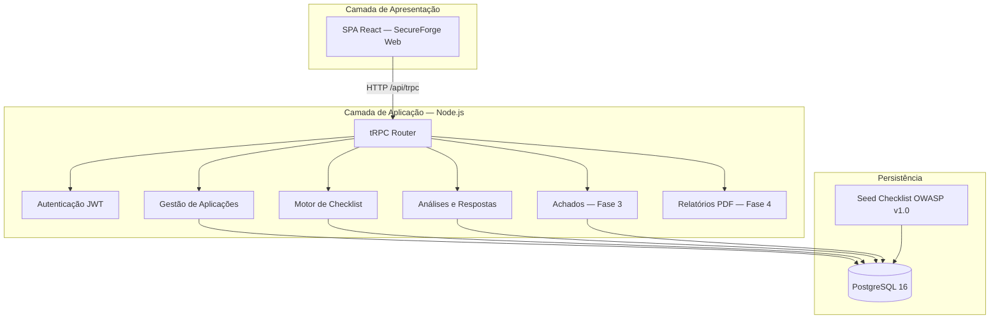
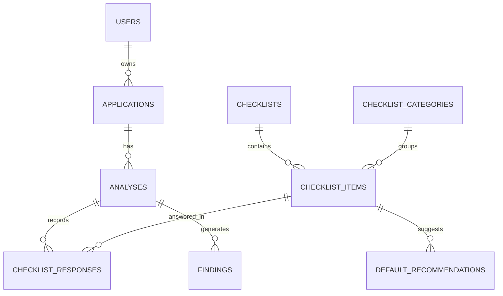
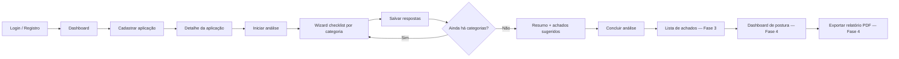

# Relatório Técnico — Primeira Entrega

**Disciplina:** Projeto Integrador — Desenvolvimento de Ferramentas de Segurança Aplicada  
**Entrega:** Definição da trilha, foco da ferramenta e arquitetura inicial  
**Data:** 15/06/2026  
**Versão do documento:** 1.0

> **Documento histórico (Entrega 1).** Para o **estado atual** (Entrega 3, 30/06/2026), consulte [RELATORIO_ENTREGA_3.md](./RELATORIO_ENTREGA_3.md), [MANUAL.md](./MANUAL.md) e [DEMO.md](./DEMO.md). Entrega 2: [RELATORIO_ENTREGA_2.md](./RELATORIO_ENTREGA_2.md).

---

## Objetivo desta entrega

Esta entrega demonstra que a equipe:

- Compreendeu a proposta da disciplina;
- Escolheu a trilha **AppHardener** de forma consciente;
- Definiu um foco claro e viável para a solução;
- Organizou a estrutura inicial do projeto;
- Preparou a base para o desenvolvimento incremental ao longo da disciplina.

> **Nota:** Esta etapa corresponde ao **planejamento da solução e modelagem inicial**. A ferramenta já possui implementação parcial (Fases 0 a 2), o que valida a viabilidade técnica do plano apresentado.

---

## 1. Identificação da equipe

| Campo | Informação |
|---|---|
| **Nome da equipe** | Equipe SecureForge Web |
| **Integrantes** | Josias da Silva Bentes — Analista de Banco de Dados |
| | Keven Coimbra — Analista Desenvolvedor Backend |
| | Nattan Lobato — Analista Desenvolvedor Backend |
| | Margefson Barros — Analista Frontend e Integrador |

---

## 2. Trilha escolhida

**AppHardener** (Trilha 1)

A trilha AppHardener orienta o desenvolvimento de ferramentas para **diagnóstico de segurança** e **hardening gradual** de aplicações web, com foco em checklist guiado, registro de achados, priorização e acompanhamento de melhorias — e não em scanners automatizados ou pentest profissional.

**Por que esta trilha?**

- Alinha-se ao perfil da equipe (desenvolvimento web full stack + banco de dados);
- Permite reaproveitar base técnica de um projeto anterior (sistema de incidentes com autenticação, API e dashboard);
- Atende ao problema real de equipes pequenas que não possuem processo estruturado de revisão AppSec;
- Viabiliza entrega incremental em ~1 semana, com protótipo demonstrável.

---

## 3. Nome da ferramenta

**SecureForge Web**  
*Plataforma de Diagnóstico e Hardening de Aplicações Web*

| Aspecto | Definição |
|---|---|
| Nome comercial / interface | **SecureForge Web** |
| Codinome acadêmico (AVA) | **AppHardener** — Trilha 1 |
| Repositório / pacote | `secure_forge_web` / [github.com/margefson/secureforgeweb](https://github.com/margefson/secureforgeweb) |

O nome reflete o propósito central: avaliar e melhorar a **postura de segurança** de aplicações web de forma proativa e orientada à correção.

---

## 4. Foco da ferramenta

### 4.1 Explicação objetiva

O foco da **SecureForge Web** é apoiar o **hardening de aplicações web** por meio de um **checklist guiado** alinhado a boas práticas OWASP/ASVS, cobrindo controles de:

- autenticação e autorização;
- validação de entrada;
- proteção de credenciais e segredos;
- headers de segurança;
- exposição de endpoints;
- tratamento de erros;
- proteção de dados sensíveis;
- redução de superfície de ataque.

A ferramenta conduz o analista por categorias de controle, registra conformidade, gera achados para itens não conformes, sugere recomendações de correção e consolida o progresso em dashboard e relatório.

### 4.2 Recorte adotado pela equipe

| Incluído | Excluído |
|---|---|
| Checklist manual/guiado por categorias OWASP | Scanner profissional de vulnerabilidades |
| Cadastro e gestão de aplicações web | Crawling avançado / DAST completo |
| Registro de achados com severidade e status | Pentest automatizado |
| Recomendações de hardening por item | Análise estática profunda de código-fonte |
| Dashboard e relatório PDF simples | Integração SIEM / SOC em tempo real |
| Histórico de análises por aplicação | Machine Learning para classificação |

### 4.3 Escopo mínimo viável da primeira versão (MVP)

A primeira versão funcional (MVP) deve permitir que um usuário:

1. **Cadastre** uma aplicação web (nome, URL, stack, descrição);
2. **Inicie uma análise** e percorra o checklist v1.0 (24 itens, 9 categorias);
3. **Registre respostas** de conformidade (conforme, parcial, não conforme, não aplicável) com observações;
4. **Gere achados** a partir de itens não conformes, com severidade sugerida;
5. **Visualize recomendações** de correção associadas a cada achado;
6. **Acompanhe status** dos achados (aberto → em correção → resolvido);
7. **Consulte um dashboard** com resumo de postura e progresso;
8. **Exporte relatório simples** (PDF) da análise.

**Status de implementação (15/06/2026):**

| Fase | Escopo | Status |
|---|---|---|
| Fase 0 | Setup, rebrand, remoção ML/SIEM | Concluída |
| Fase 1 | Aplicações + checklist seed | Concluída |
| Fase 2 | Análise guiada + wizard | Concluída |
| Fase 3 | Achados + recomendações | Concluída |
| Fase 4 | Dashboard métricas + PDF | Concluída |
| Fase 5 | Refinamento e entrega final | Concluída |

---

## 5. Funcionalidades planejadas

### 5.1 Funcionalidades obrigatórias

| ID | Funcionalidade | Descrição |
|---|---|---|
| RF01 | Cadastro de aplicação | CRUD de aplicações com nome, URL, descrição e stack |
| RF02 | Checklist de análise | Formulário estruturado por categorias OWASP |
| RF03 | Registro de achados | Documentar fragilidades identificadas na análise |
| RF04 | Severidade / prioridade | Classificar achados (crítica, alta, média, baixa) |
| RF05 | Recomendação de correção | Associar ação de hardening a cada achado |
| RF06 | Visualização consolidada | Dashboard com resumo de achados e progresso |
| RF07 | Relatório simples | Exportação PDF da postura de segurança |

### 5.2 Funcionalidades desejáveis / opcionais

| ID | Funcionalidade | Descrição |
|---|---|---|
| RF08 | Acompanhamento de progresso | Fluxo de status dos achados com datas |
| RF09 | Histórico de análises | Múltiplas avaliações da mesma aplicação |
| RF10 | Catálogo de controles OWASP | Seed configurável de itens e recomendações |
| RF11 | Filtros e busca | Filtrar achados por severidade, categoria e status |
| RF12 | Gestão de usuários | Login, registro e papéis (user, analista, admin) |
| — | Notificações in-app | Alertas para achados críticos |
| — | Admin de checklist | Gestão de itens pelo administrador |
| — | Verificação passiva de headers HTTP | Fetch da URL cadastrada (pós-MVP) |

---

## 6. Arquitetura inicial

### 6.1 Descrição resumida

A SecureForge Web adota uma **aplicação web monolítica modular** em monorepo, com separação em camadas:

- **Apresentação:** SPA React (telas, wizard, dashboard);
- **Aplicação:** API Express + tRPC (orquestração, regras de negócio, autenticação);
- **Domínio:** entidades Aplicação → Análise → Resposta → Achado → Recomendação;
- **Persistência:** PostgreSQL com Drizzle ORM e migrações versionadas.

A comunicação entre frontend e backend é **type-safe** via tRPC. O banco centraliza o modelo de domínio; o catálogo de checklist e recomendações padrão é carregado via seed.

### 6.2 Diagrama de arquitetura

### 6.3 Modelo de domínio (visão simplificada)

---

## 7. Módulos principais

| Módulo | Responsabilidade | Status |
|---|---|---|
| **Gestão de Aplicações** | CRUD de projetos web, metadados e vínculo com análises | Implementado |
| **Motor de Checklist** | Catálogo OWASP v1.0, categorias e itens com severidade sugerida | Implementado |
| **Motor de Análises** | Criar análise, wizard por categoria, salvar respostas, progresso | Implementado |
| **Gestão de Achados** | Criar, classificar, atualizar status e vincular evidências | Fase 3 |
| **Motor de Recomendações** | Sugerir hardening com base no item e catálogo padrão | Parcial (sugestão na Fase 2) |
| **Dashboard e Métricas** | Score de postura, distribuição por severidade, progresso | Fase 4 |
| **Gerador de Relatórios** | Exportação PDF da análise | Fase 4 |
| **Autenticação e Autorização** | Login, registro, sessão JWT, RBAC, isolamento por usuário | Implementado |

---

## 8. Fluxo principal de uso

### Descrição narrativa do fluxo

1. O **operador** acessa a SecureForge Web e autentica-se (registro ou login).
2. No **dashboard**, visualiza quantidade de aplicações cadastradas e itens do checklist disponíveis.
3. **Cadastra uma aplicação** informando nome, URL, descrição e tecnologias utilizadas.
4. Na **página da aplicação**, consulta o catálogo de controles e clica em **Iniciar análise**.
5. O **wizard de checklist** apresenta uma categoria por vez (ex.: Autenticação), com barra de progresso.
6. Para cada item, o analista marca a **conformidade** (conforme, parcial, não conforme, não aplicável) e opcionalmente registra **observações**.
7. Ao salvar cada categoria, o sistema persiste as respostas e **sugere achados** para itens parcialmente ou totalmente não conformes.
8. Ao concluir todas as categorias, o analista visualiza o **resumo** e finaliza a análise.
9. Nas fases seguintes, os achados serão persistidos, receberão recomendações, poderão ter status atualizado e alimentarão o dashboard e o relatório PDF.

---

## 9. Tecnologias previstas

| Camada | Tecnologia | Justificativa |
|---|---|---|
| **Runtime** | Node.js 22 | Ecossistema maduro, mesma base do projeto de referência |
| **Linguagem** | TypeScript | Tipagem estática, segurança em API e frontend |
| **Frontend** | React 19 + Vite 7 | SPA moderna com HMR e boa produtividade |
| **UI** | Tailwind CSS 4 + shadcn/ui | Design system consistente e acessível |
| **Roteamento** | Wouter | Leve, adequado ao escopo do protótipo |
| **Backend** | Express 4 | Servidor HTTP consolidado |
| **API** | tRPC 11 | Contratos type-safe entre frontend e backend |
| **ORM** | Drizzle ORM | Schema TypeScript, migrações SQL versionadas |
| **Banco** | PostgreSQL 16 | Relacional, adequado ao modelo de domínio |
| **Autenticação** | JWT + cookies HttpOnly + bcrypt (custo 12) | Sessão segura e hash de senhas |
| **Validação** | Joi + Zod | Validação de entrada na API |
| **Testes** | Vitest | Testes unitários e de router |
| **Relatórios** | PDFKit (Node) | Geração de PDF sem dependência Python |
| **Gráficos** | Recharts | Dashboard de métricas (Fase 4) |
| **Infra local** | Docker Compose | PostgreSQL reproduzível |
| **Gerenciador** | pnpm (monorepo) | `frontend/` + `backend/` na mesma raiz |

**Estratégia de base:** fork adaptativo do projeto [incident_security_system](https://github.com/margefson/incident_security_system), removendo ML/Python/SIEM e migrando o domínio de incidentes para aplicações + checklist + achados.

---

## 10. Organização inicial da equipe

| Integrante | Papel | Responsabilidades principais |
|---|---|---|
| **Josias da Silva Bentes** | Analista de Banco de Dados | Modelagem do schema Drizzle; migrações SQL; seed do checklist OWASP; scripts `db:setup`, `wait-for-postgres`; documentação do modelo de dados |
| **Keven Coimbra** | Analista Desenvolvedor Backend | Routers tRPC (`applications`, `analyses`, `findings`); regras de domínio; validação Joi; testes Vitest das APIs |
| **Nattan Lobato** | Analista Desenvolvedor Backend | Autenticação e RBAC; middleware de segurança; helpers de persistência (`*.db.ts`); integração backend ↔ banco |
| **Margefson Barros** | Analista Frontend e Integrador | Telas React; wizard de checklist; layout operacional; rotas; integração tRPC no cliente; documentação arquitetural e guia de implementação; coordenação entre camadas |

### Divisão por fases do cronograma

| Semanas | Fase | Foco | Responsáveis sugeridos |
|---|---|---|---|
| S1 | F0 | Setup, rebrand, limpeza do fork | Todos |
| S2–S3 | F1 | Schema + aplicações + seed checklist | Josias + Keven + Margefson |
| S4–S5 | F2 | Análises + wizard | Keven + Nattan + Margefson |
| S6–S7 | F3 | Achados + recomendações | Keven + Nattan + Margefson |
| S8–S9 | F4 | Dashboard + PDF | Margefson + Keven |
| S10–S12 | F5 | Refinamento, testes, demo | Todos |

---

## 11. Protótipo de telas

O protótipo foi implementado como **interface funcional em desenvolvimento** (tema escuro, identidade SecureForge Web). Telas principais:

### 11.1 Tela inicial / Dashboard (`/dashboard`)

- Boas-vindas e visão geral do projeto;
- Cards: aplicações cadastradas, itens do checklist OWASP, score de postura (Fase 4);
- Roadmap de implementação por fases;
- Atalho para cadastrar nova aplicação.

### 11.2 Tela de cadastro de aplicação (`/applications/new`)

- Formulário: nome, URL base, descrição, stack tecnológica;
- Validação de campos;
- Redirecionamento para lista ou detalhe após salvar.

### 11.3 Tela de lista de aplicações (`/applications`)

- Listagem das aplicações do usuário;
- Acesso ao detalhe e criação de nova aplicação.

### 11.4 Tela de detalhe da aplicação (`/applications/:id`)

- Metadados da aplicação (URL, descrição, data de cadastro);
- Botão **Iniciar análise** / **Continuar análise**;
- Histórico de análises realizadas;
- Pré-visualização do checklist v1.0 por categoria.

### 11.5 Tela de wizard de checklist (`/analyses/:id/checklist`)

- Barra de progresso geral;
- Navegação por categorias (9 abas);
- Para cada item: código OWASP, descrição, severidade sugerida;
- Seleção de conformidade (4 opções) + campo de observações;
- Botões **Salvar e continuar** e **Concluir análise**;
- Tela de resumo com achados sugeridos ao final.

### 11.6 Telas de autenticação (`/login`, `/register`)

- Login com e-mail e senha;
- Registro com checklist visual de requisitos de senha;
- Sessão persistente via cookie HttpOnly.

### Referência visual

As telas em funcionamento podem ser demonstradas em:

- `http://localhost:5173/` — landing
- `http://localhost:5173/dashboard` — dashboard
- `http://localhost:5173/applications` — aplicações
- `http://localhost:5173/applications/1` — detalhe (ex.: aplicação Pomodoro)
- `http://localhost:5173/analyses/:id/checklist` — wizard

---

## 12. Link do repositório

| Item | Valor |
|---|---|
| **Repositório SecureForge Web** | https://github.com/margefson/secureforgeweb |

Documentação complementar no repositório:

- `docs/PROJETO_ARQUITETURAL.md` — visão arquitetural completa
- `docs/GUIA_IMPLEMENTACAO.md` — roadmap, matriz de requisitos e cronograma
- `docs/BRAND.md` — identidade visual, logo e ícone

---

## Referências

- Disciplina: Projeto Integrador — Desenvolvimento de Ferramentas de Segurança Aplicada
- Trilha 1 — AppHardener (AVA)
- OWASP Application Security Verification Standard (ASVS)
- OWASP Top 10 / Cheat Sheets
- Projeto base: [incident_security_system](https://github.com/margefson/incident_security_system)

---