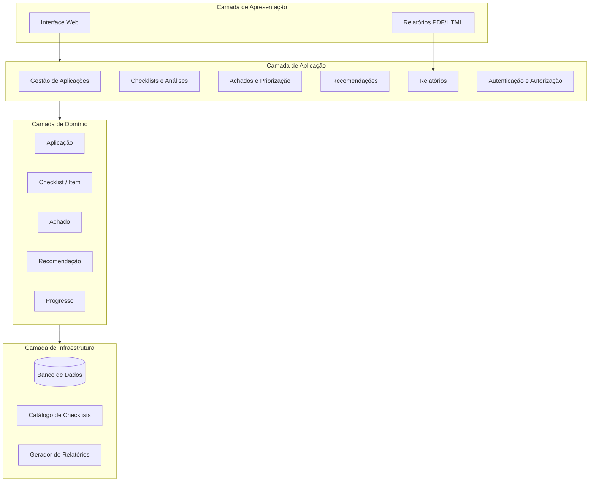
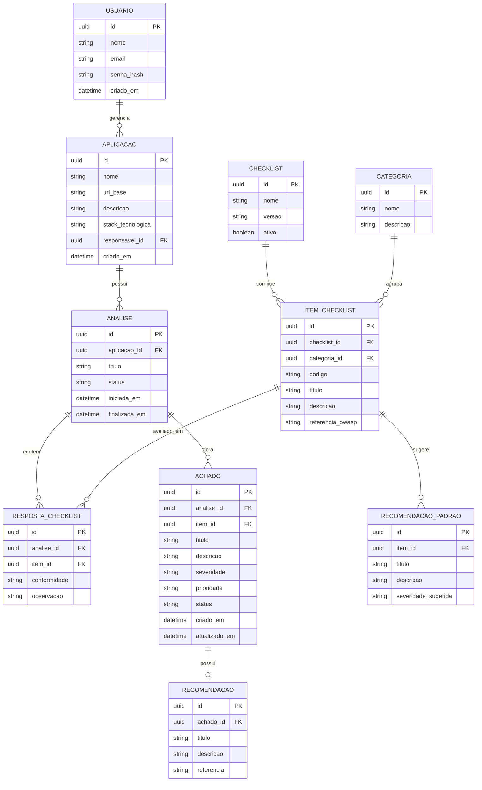
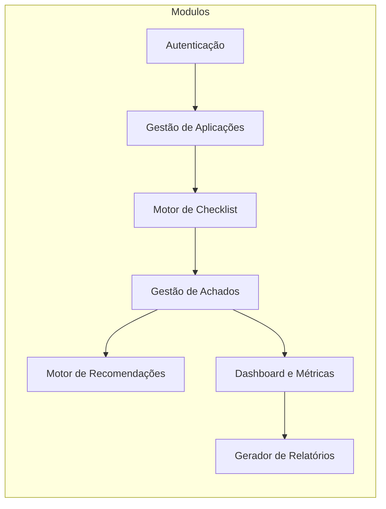
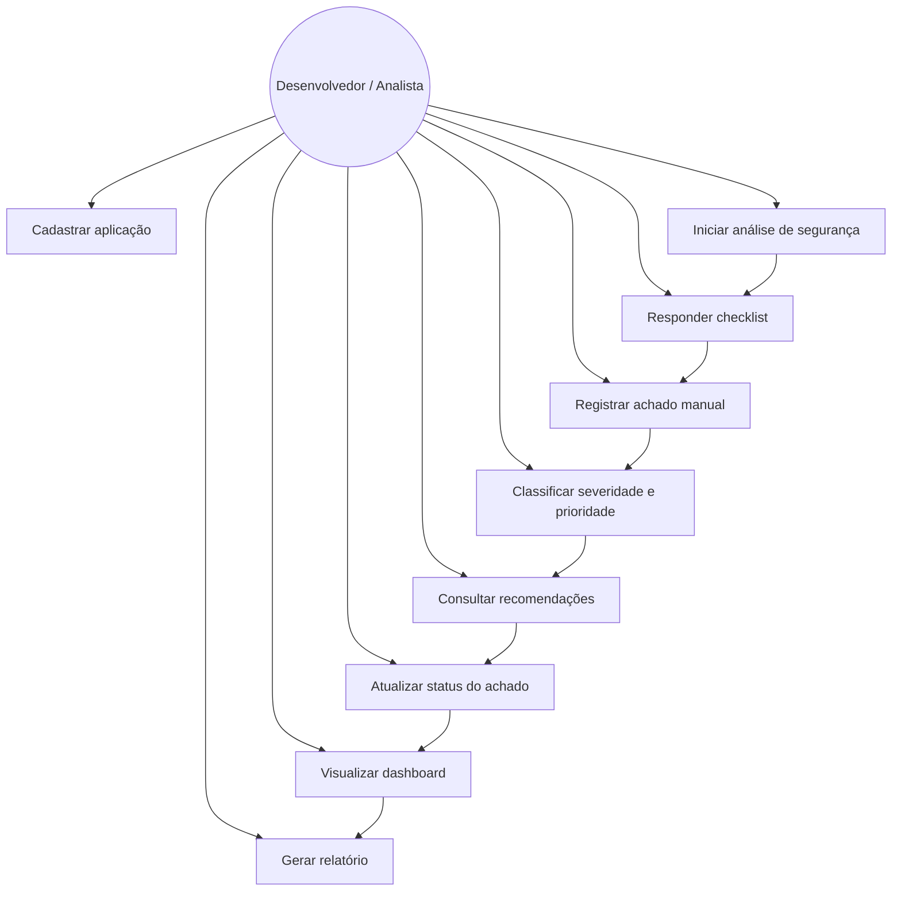
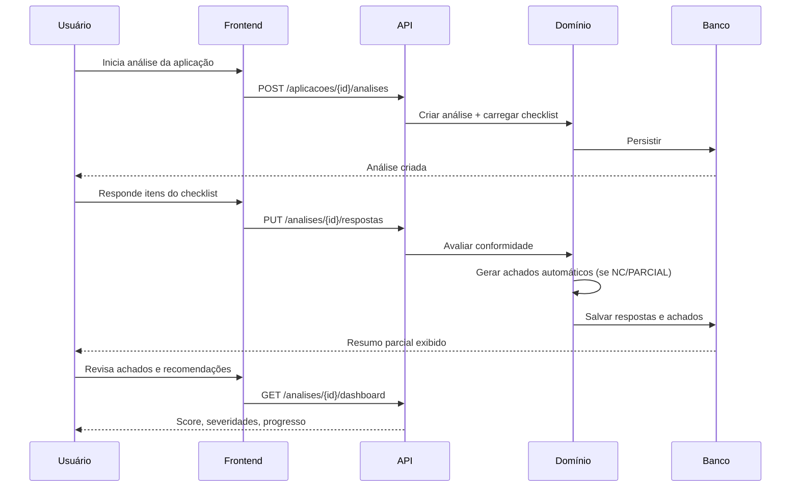
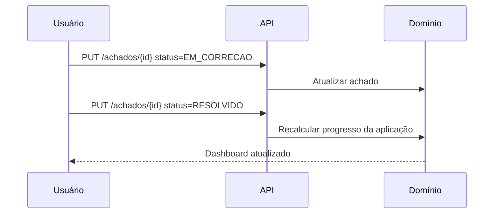
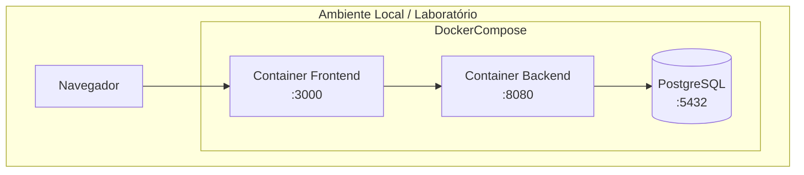

# Projeto Arquitetural — AppHardener

**Disciplina:** Projeto Integrador — Desenvolvimento de Ferramentas de Segurança Aplicada  
**Trilha:** AppHardener  
**Versão:** 1.2  
**Data:** 30/06/2026

> Para o **estado operacional atual**, consulte [RELATORIO.md](RELATORIO.md) e [MANUAL.md](MANUAL.md). Este documento descreve a arquitetura alvo e requisitos; a implementação evoluiu com IA por usuário, admin benchmark e migrações `0015`–`0016`.

---

## 1. Introdução

### 1.1 Contexto

O AppHardener é uma ferramenta voltada ao **diagnóstico de segurança** e ao **fortalecimento gradual (hardening)** de aplicações web. Foi concebida para equipes pequenas, laboratórios acadêmicos e contextos em que não há um fluxo estruturado para revisar a postura de segurança de uma aplicação em funcionamento.

Diferentemente de scanners profissionais ou suítes de pentest, o AppHardener atua como um **assistente guiado e orientado à correção**, ajudando a identificar fragilidades, registrar achados, priorizar riscos e acompanhar melhorias ao longo do tempo.

### 1.2 Problema

Muitas equipes possuem aplicações web em desenvolvimento ou em produção, mas enfrentam incerteza sobre:

- quais controles de segurança já foram implementados;
- quais mecanismos ainda estão ausentes;
- quais riscos são mais relevantes;
- quais ações devem ser priorizadas.

Ferramentas enterprise costumam focar em automação e escala. O AppHardener preenche a lacuna de um processo **simples, didático e acionável** para revisão e hardening.

### 1.3 Objetivo do sistema

Desenvolver um protótipo funcional que permita:

1. Cadastrar aplicações ou projetos web.
2. Aplicar um checklist de análise de segurança.
3. Registrar achados com severidade e prioridade.
4. Receber recomendações de correção (hardening).
5. Acompanhar o progresso das melhorias.
6. Gerar um relatório consolidado da postura de segurança.

### 1.4 Escopo

| Dentro do escopo | Fora do escopo |
|---|---|
| Cadastro e gestão de aplicações | Scanner profissional de vulnerabilidades |
| Checklist guiado de controles | Crawling avançado / DAST completo |
| Registro e classificação de achados | Suíte completa de pentest |
| Recomendações de hardening | Substituição de ferramentas enterprise |
| Dashboard e relatório simples | Análise automatizada profunda de código |
| Análise assistida (headers HTTP, Git, IA) com revisão humana | Veredicto 100% automático sem analista |

### 1.5 Público-alvo

- Equipes pequenas de desenvolvimento
- Laboratórios acadêmicos e grupos de pesquisa
- Pequenas empresas
- Equipes AppSec iniciantes
- Projetos que precisam revisar postura de segurança web

### 1.6 Relação com as disciplinas do módulo

| Disciplina | Contribuição no AppHardener |
|---|---|
| **Segurança de Redes** | Superfície de ataque, serviços expostos, componentes acessíveis, riscos de exposição |
| **Segurança de Aplicações Web e Móveis** | Autenticação, autorização, XSS, exposição de dados, validação, headers |
| **Projeto e Desenvolvimento de Código Seguro** | OWASP Top 10, validação segura, proteção de segredos, SDLC seguro, boas práticas |

---

## 2. Visão geral da arquitetura

### 2.1 Estilo arquitetural

O sistema adota uma arquitetura **em camadas (layered)** com separação clara entre apresentação, aplicação, domínio e persistência. Para o protótipo acadêmico, recomenda-se uma **aplicação web monolítica modular**, evitando complexidade desnecessária de microsserviços.



### 2.2 Princípios arquiteturais

1. **Simplicidade:** protótipo funcional, não produto industrial.
2. **Modularidade:** cada capacidade (aplicação, checklist, achado, relatório) em módulo coeso.
3. **Rastreabilidade:** todo achado vinculado a aplicação, item de checklist e recomendação.
4. **Orientação à correção:** priorizar fluxo de melhoria, não apenas inventário de falhas.
5. **Extensibilidade:** catálogo de checklists e recomendações configurável para evolução futura.

---

## 3. Requisitos

### 3.1 Requisitos funcionais (mínimos obrigatórios)

| ID | Requisito | Descrição |
|---|---|---|
| RF01 | Cadastro de aplicação | Registrar nome, URL/base, descrição, tecnologia e responsável |
| RF02 | Checklist de segurança | Aplicar formulário/checklist estruturado por categorias |
| RF03 | Registro de achados | Documentar fragilidades identificadas durante a análise |
| RF04 | Severidade/prioridade | Classificar achados (ex.: Crítica, Alta, Média, Baixa) |
| RF05 | Recomendação de correção | Associar ação de hardening a cada achado ou item não conforme |
| RF06 | Visualização consolidada | Dashboard com resumo de achados, status e progresso |
| RF07 | Relatório simples | Exportar postura de segurança da aplicação |

### 3.2 Requisitos funcionais (complementares)

| ID | Requisito | Descrição |
|---|---|---|
| RF08 | Acompanhamento de progresso | Marcar achados como aberto, em correção ou resolvido |
| RF09 | Histórico de análises | Registrar múltiplas avaliações da mesma aplicação ao longo do tempo |
| RF10 | Catálogo de controles | Itens pré-definidos alinhados a OWASP e boas práticas |
| RF11 | Filtros e busca | Filtrar achados por severidade, categoria e status |
| RF12 | Gestão de usuários | Login básico para equipe (opcional na v1, recomendado) |

### 3.3 Requisitos não-funcionais

| ID | Requisito | Critério |
|---|---|---|
| RNF01 | Usabilidade | Interface clara para equipes sem experiência AppSec avançada |
| RNF02 | Desempenho | Respostas em até 2s para operações comuns em protótipo |
| RNF03 | Manutenibilidade | Código modular, documentado e testável |
| RNF04 | Segurança | Proteção de dados cadastrados; senhas com hash; validação de entrada |
| RNF05 | Portabilidade | Execução local ou em container Docker |
| RNF06 | Auditabilidade | Registro de datas de criação/atualização de achados e análises |

---

## 4. Modelo de domínio

### 4.1 Entidades principais



### 4.2 Enumerações e regras de negócio

**Conformidade do checklist:** `CONFORME`, `PARCIAL`, `NAO_CONFORME`, `NAO_APLICAVEL`

**Severidade:** `CRITICA`, `ALTA`, `MEDIA`, `BAIXA`

**Prioridade:** `IMEDIATA`, `CURTO_PRAZO`, `MEDIO_PRAZO`, `BAIXA`

**Status do achado:** `ABERTO`, `EM_CORRECAO`, `RESOLVIDO`, `ACEITO_RISCO`

**Status da análise:** `RASCUNHO`, `EM_ANDAMENTO`, `CONCLUIDA`

**Regras:**

1. Item `NAO_CONFORME` ou `PARCIAL` pode gerar achado automaticamente.
2. Severidade padrão vem do catálogo; analista pode ajustar.
3. Progresso da aplicação = percentual de achados resolvidos sobre total.
4. Relatório consolida achados abertos por severidade e categoria.

---

## 5. Catálogo inicial de controles (checklist)

O checklist é o núcleo do AppHardener. A versão inicial (`v1.0`) cobre categorias alinhadas às três disciplinas do módulo:

| Categoria | Exemplos de itens | Disciplina relacionada |
|---|---|---|
| Autenticação | Política de senha, MFA, bloqueio por tentativas, expiração de sessão | Código Seguro / App Web |
| Autorização | Controle de acesso por perfil, princípio do menor privilégio | App Web / Código Seguro |
| Validação de entrada | Sanitização, parametrização de queries, validação server-side | App Web / Código Seguro |
| Proteção de credenciais | Hash de senhas, rotação de segredos, ausência em repositório | Código Seguro |
| Headers de segurança | CSP, HSTS, X-Frame-Options, X-Content-Type-Options | App Web |
| Exposição de endpoints | Rotas administrativas protegidas, APIs sem autenticação | Redes / App Web |
| Mensagens de erro | Sem vazamento de stack trace ou dados sensíveis | App Web |
| Proteção de dados sensíveis | Criptografia em trânsito/repouso, mascaramento em logs | Código Seguro |
| Superfície de ataque | Serviços expostos, portas desnecessárias, componentes públicos | Redes |

Cada item possui: código (`AUTH-01`), título, descrição, referência OWASP/CWE quando aplicável e recomendação padrão associada.

---

## 6. Arquitetura de componentes

### 6.1 Módulos do sistema



| Módulo | Responsabilidade |
|---|---|
| **Gestão de Aplicações** | CRUD de projetos web, metadados e vínculo com análises |
| **Motor de Checklist** | Carregar catálogo, conduzir análise guiada, registrar respostas |
| **Gestão de Achados** | Criar, classificar, atualizar status e vincular evidências |
| **Motor de Recomendações** | Sugerir hardening com base em item/achado e catálogo padrão |
| **Dashboard e Métricas** | Score de postura, distribuição por severidade, progresso |
| **Gerador de Relatórios** | Exportação HTML/PDF da análise |
| **Autenticação** | Login, sessão e controle de acesso básico |

### 6.2 Camadas e responsabilidades

#### Camada de Apresentação (Frontend)
- Telas: lista de aplicações, cadastro, wizard de checklist, painel de achados, dashboard, relatório.
- Comunicação via API REST.
- Validação básica de formulários no cliente.

#### Camada de Aplicação (Backend / API)
- Orquestra casos de uso.
- Aplica regras de negócio (geração automática de achados, cálculo de progresso).
- Expõe endpoints REST versionados (`/api/v1/...`).

#### Camada de Domínio
- Entidades, enums, serviços de domínio puros.
- Independente de framework e banco.

#### Camada de Infraestrutura
- Repositórios (ORM).
- Seed do catálogo de checklist.
- Geração de relatório (template HTML → PDF opcional).

---

## 7. Casos de uso



### UC01 — Cadastrar aplicação
**Ator:** Desenvolvedor / Analista  
**Fluxo:** informa nome, URL, stack e descrição → sistema valida e persiste → aplicação disponível para análise.

### UC02 — Iniciar análise de segurança
**Ator:** Desenvolvedor / Analista  
**Fluxo:** seleciona aplicação → escolhe checklist v1.0 → análise criada em status `EM_ANDAMENTO`.

### UC03 — Responder checklist
**Ator:** Desenvolvedor / Analista  
**Fluxo:** percorre categorias → marca conformidade → adiciona observações → itens não conformes sugerem criação de achado.

### UC04 — Registrar achado
**Ator:** Desenvolvedor / Analista  
**Fluxo:** define título, descrição, severidade, prioridade, evidência → achado vinculado à análise.

### UC09 — Gerar relatório
**Ator:** Desenvolvedor / Analista  
**Fluxo:** seleciona análise → sistema consolida métricas, achados e recomendações → exporta HTML/PDF.

---

## 8. Arquitetura de API (REST)

### 8.1 Endpoints principais

| Método | Endpoint | Descrição |
|---|---|---|
| POST | `/api/v1/auth/login` | Autenticação |
| GET/POST | `/api/v1/aplicacoes` | Listar / criar aplicações |
| GET/PUT/DELETE | `/api/v1/aplicacoes/{id}` | Detalhar / atualizar / remover |
| POST | `/api/v1/aplicacoes/{id}/analises` | Iniciar nova análise |
| GET | `/api/v1/analises/{id}` | Obter análise com respostas |
| PUT | `/api/v1/analises/{id}/respostas` | Salvar respostas do checklist |
| POST | `/api/v1/analises/{id}/achados` | Criar achado |
| GET/PUT | `/api/v1/achados/{id}` | Consultar / atualizar achado |
| GET | `/api/v1/analises/{id}/recomendacoes` | Listar recomendações |
| GET | `/api/v1/analises/{id}/dashboard` | Métricas consolidadas |
| GET | `/api/v1/analises/{id}/relatorio` | Gerar relatório |

### 8.2 Exemplo de payload — Achado

```json
{
  "titulo": "Ausência de Content-Security-Policy",
  "descricao": "A aplicação não define header CSP, aumentando risco de XSS.",
  "severidade": "ALTA",
  "prioridade": "CURTO_PRAZO",
  "status": "ABERTO",
  "item_checklist_id": "uuid-do-item",
  "evidencia": "Inspeção manual via DevTools — header ausente em /dashboard"
}
```

---

## 9. Fluxos principais

### 9.1 Fluxo de análise guiada



### 9.2 Fluxo de hardening e acompanhamento



---

## 10. Interface do usuário (visão de telas)

| Tela | Função |
|---|---|
| **Login** | Acesso à equipe |
| **Home / Aplicações** | Lista de projetos cadastrados e score resumido |
| **Nova aplicação** | Formulário de cadastro |
| **Detalhe da aplicação** | Histórico de análises e botão "Nova análise" |
| **Wizard de checklist** | Navegação por categorias com barra de progresso |
| **Painel de achados** | Tabela filtrável por severidade, status e categoria |
| **Detalhe do achado** | Descrição, recomendação, evidência e histórico de status |
| **Dashboard** | Gráficos: achados por severidade, progresso, categorias críticas |
| **Relatório** | Visualização e exportação da postura de segurança |

**Diretriz de UX:** linguagem acessível, tooltips com explicação dos controles e referências OWASP em cada item do checklist.

---

## 11. Stack tecnológica recomendada

Para equipe de até 4 integrantes, sugere-se stack produtiva e alinhada ao contexto acadêmico:

| Camada | Tecnologia sugerida | Justificativa |
|---|---|---|
| Frontend | React + TypeScript + Vite | Componentização, tipagem, ecossistema maduro |
| UI | Tailwind CSS ou Material UI | Agilidade na construção de formulários e dashboards |
| Backend | Node.js (NestJS) **ou** Python (FastAPI) | APIs REST claras, boa documentação OpenAPI |
| Banco | PostgreSQL | Relacional, adequado ao modelo de domínio |
| ORM | Prisma (Node) / SQLAlchemy (Python) | Produtividade e migrações |
| Auth | JWT + bcrypt | Simples para protótipo |
| Relatório | Template HTML + Puppeteer/wkhtmltopdf (opcional) | Exportação leve |
| Container | Docker + docker-compose | Reprodutibilidade em laboratório |
| Testes | Jest/Pytest + Supertest | Cobertura de API e regras críticas |

> A equipe pode validar a stack com base na familiaridade do grupo. O importante é manter a separação em camadas e a clareza do domínio.

---

## 12. Arquitetura de implantação



**Configuração mínima:**
- Variáveis de ambiente para URL do banco, segredo JWT e porta da API.
- Volume persistente para dados do PostgreSQL.
- Script de seed para checklist v1.0 na primeira execução.

---

## 13. Segurança da própria ferramenta

Embora o AppHardener avalie outras aplicações, ela também deve adotar boas práticas:

| Controle | Implementação |
|---|---|
| Autenticação | Login com senha hasheada (bcrypt/argon2) |
| Autorização | Usuário acessa apenas suas aplicações (RBAC simples) |
| Validação de entrada | Sanitização em todos os endpoints |
| Segredos | JWT secret e credenciais via variáveis de ambiente |
| Headers | HSTS, CSP básico, X-Content-Type-Options no frontend servido |
| Logs | Sem registrar dados sensíveis |
| HTTPS | Recomendado mesmo em ambiente de demonstração |

---

## 14. Métricas e relatório

### 14.1 Indicadores do dashboard

- **Score de postura:** percentual de itens conformes no checklist.
- **Achados abertos:** total por severidade (Crítica, Alta, Média, Baixa).
- **Taxa de resolução:** achados resolvidos / total de achados.
- **Categorias críticas:** top 3 categorias com mais não conformidades.
- **Evolução:** comparativo entre análises da mesma aplicação (quando RF09 implementado).

### 14.2 Estrutura do relatório

1. Identificação da aplicação
2. Resumo executivo (score e principais riscos)
3. Achados por severidade
4. Recomendações de hardening priorizadas
5. Detalhamento por categoria (autenticação, headers, etc.)
6. Plano de ação sugerido (imediato, curto e médio prazo)

---

## 15. Plano de entregas incrementais

Alinhado à disciplina com entregas parciais:

| Sprint | Entrega | Funcionalidades |
|---|---|---|
| **S1** | Fundação | Setup do projeto, modelagem, cadastro de aplicação, checklist seed |
| **S2** | Análise | Fluxo de análise, respostas do checklist, geração automática de achados |
| **S3** | Hardening | Severidade, prioridade, recomendações, atualização de status |
| **S4** | Consolidação | Dashboard, relatório, autenticação, refinamentos e apresentação final |

---

## 16. Riscos e mitigações

| Risco | Impacto | Mitigação |
|---|---|---|
| Escopo excessivo | Atraso nas entregas | Priorizar RF01–RF07; RF08–RF12 como evolução |
| Checklist genérico demais | Baixa utilidade prática | Ancorar itens em OWASP Top 10 e exemplos reais |
| Complexidade técnica | Dificuldade da equipe | Monólito modular; evitar microsserviços |
| Falta de dados para demo | Apresentação fraca | Cadastrar aplicação de laboratório (ex.: app vulnerável controlada) |

---

## 17. Evoluções futuras (pós-protótipo)

- Integração com análise passiva de headers HTTP (fetch da URL cadastrada).
- Comparativo entre versões de análise (maturidade ao longo do tempo).
- Templates de checklist por tipo de app (API REST, SPA, monólito).
- Exportação para formatos usados em auditorias.
- Submissão ao Salão de Ferramentas do SBSeg.

---

## 18. Conclusão

O AppHardener, conforme definido neste projeto arquitetural, atende ao perfil esperado: uma ferramenta **leve, guiada e orientada à correção** para diagnóstico e hardening de aplicações web. A arquitetura em camadas, o modelo de domínio centrado em aplicação–análise–achado–recomendação e o catálogo de checklist alinhado ao módulo de Segurança Aplicada garantem coerência acadêmica e viabilidade de implementação por uma equipe de até quatro integrantes.

O protótipo resultante será **demonstrável, útil em contextos reais de pequena escala** e com caminho claro de evolução, sem competir com scanners ou plataformas enterprise.

---

## Referências

- OWASP Top 10 (2021/2025)
- OWASP Application Security Verification Standard (ASVS)
- OWASP Cheat Sheet Series
- Conteúdos das disciplinas: Segurança de Redes, Segurança de Aplicações Web e Móveis, Projeto e Desenvolvimento de Código Seguro
