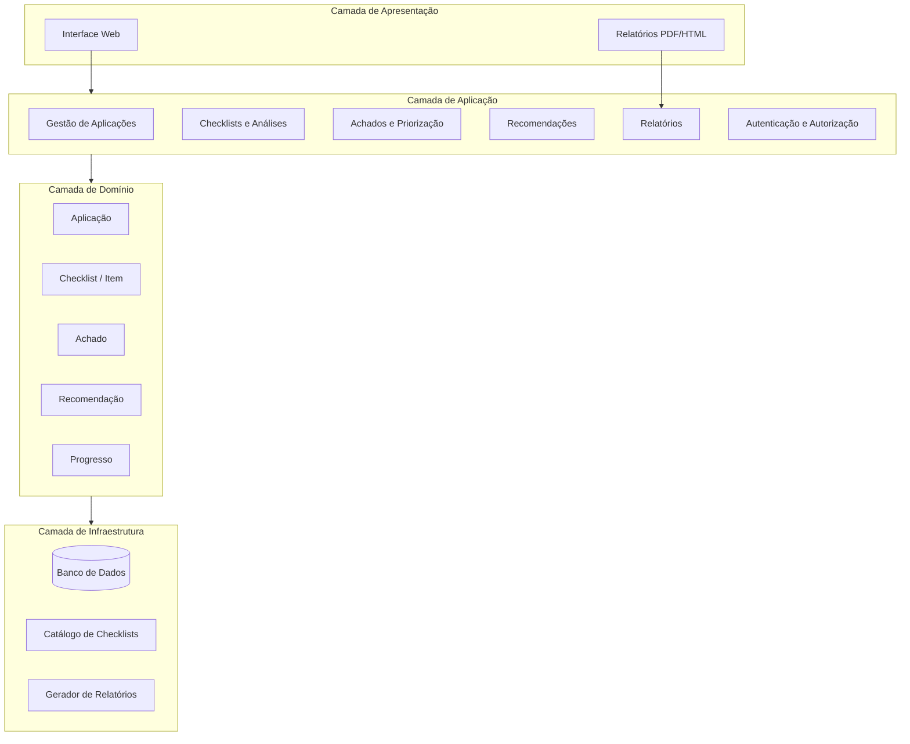
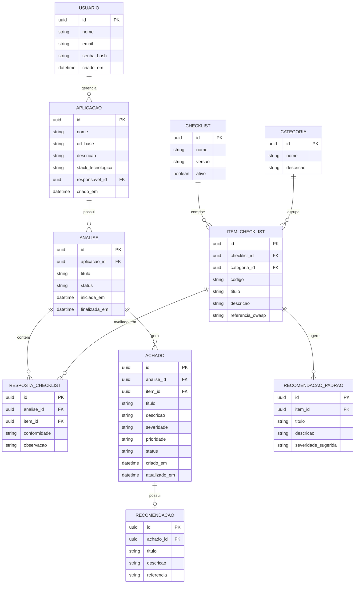
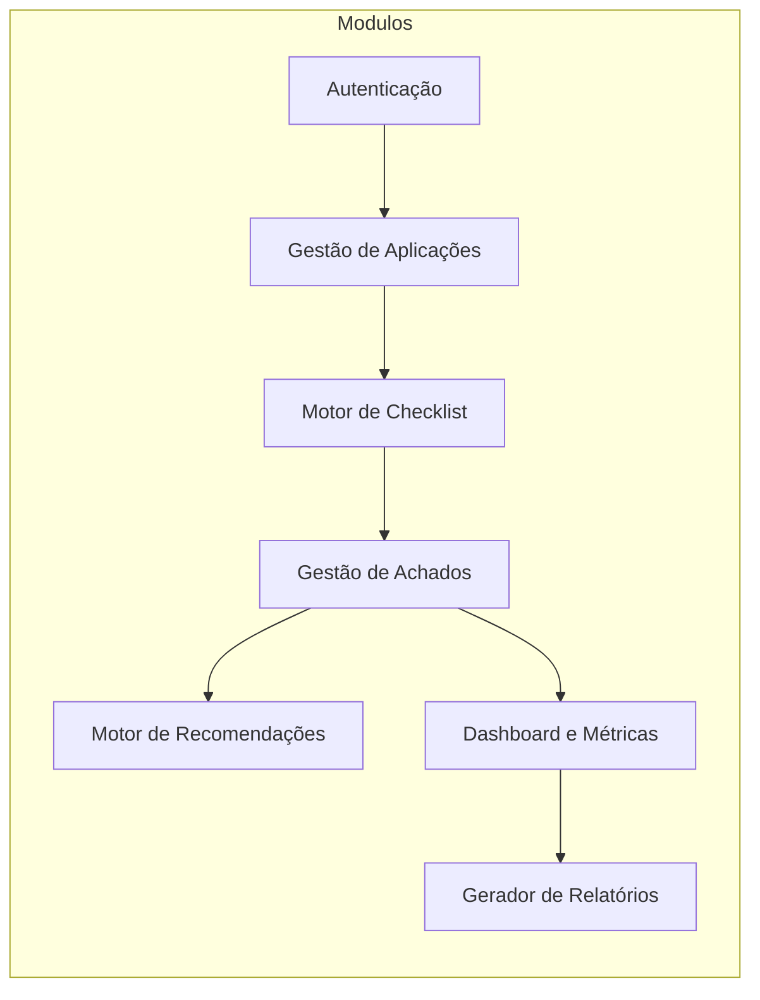
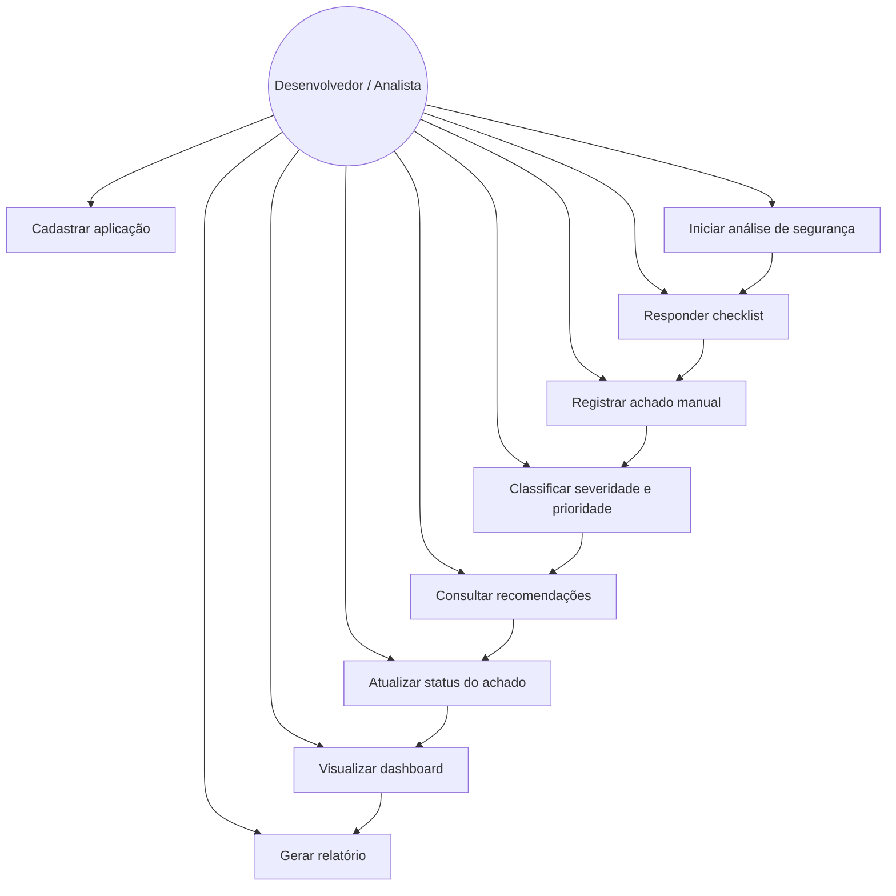
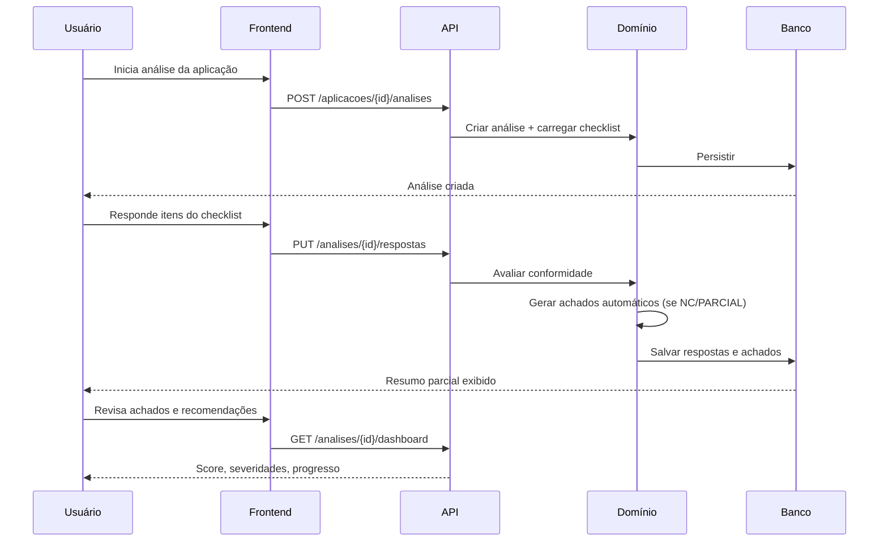
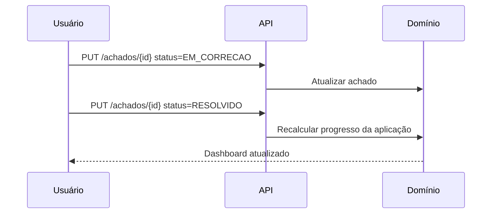
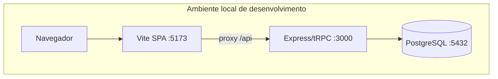

# Projeto Arquitetural — SecureForge Web

**Produto:** SecureForge Web  
**Repositório:** [github.com/secureforgeweb/secureforgeweb](https://github.com/secureforgeweb/secureforgeweb)  
**Versão do documento:** 1.4  
**Data:** 24/07/2026

> Para o **estado operacional atual**, consulte [MANUAL.md](MANUAL.md), o [índice da documentação](README.md), o [diagrama de arquitetura](screenshots/arquitetura.png) e os [vídeos de demonstração](https://drive.google.com/drive/folders/1oJRC9_3Zjx5ahBdgdXSajCKXhYjytKWX?usp=drive_link). Este documento descreve a arquitetura e os requisitos da plataforma; a implementação inclui IA por usuário, visão administrativa com benchmark, **catálogo ASVS 5.0**, **i18n PT/EN** e migrações `0015`–`0019`.

---

## 1. Introdução

### 1.1 Contexto

A **SecureForge Web** é uma plataforma voltada ao **diagnóstico de segurança** e ao **fortalecimento gradual (hardening)** de aplicações web. Foi concebida para equipes pequenas, laboratórios, grupos de pesquisa e contextos em que não há um fluxo estruturado para revisar a postura de segurança de uma aplicação em funcionamento.

Diferentemente de scanners profissionais ou suítes de pentest, a SecureForge Web atua como um **assistente guiado e orientado à correção**, ajudando a identificar fragilidades, registrar achados, priorizar riscos e acompanhar melhorias ao longo do tempo.

### 1.2 Problema

Muitas equipes possuem aplicações web em desenvolvimento ou em produção, mas enfrentam incerteza sobre:

- quais controles de segurança já foram implementados;
- quais mecanismos ainda estão ausentes;
- quais riscos são mais relevantes;
- quais ações devem ser priorizadas.

Ferramentas enterprise costumam focar em automação e escala. A SecureForge Web preenche a lacuna de um processo **simples, rastreável e acionável** para revisão e hardening.

### 1.3 Objetivo do sistema

Disponibilizar uma plataforma funcional que permita:

1. Cadastrar aplicações ou projetos web.
2. Aplicar um checklist de análise de segurança.
3. Registrar achados com severidade e prioridade.
4. Receber recomendações de correção (hardening).
5. Acompanhar o progresso das melhorias.
6. Gerar um relatório consolidado da postura de segurança.

### 1.4 Escopo

| Dentro do escopo | Fora do escopo |
|---|---|
| Cadastro e gestão de aplicações | Scanner profissional de vulnerabilidades |
| Checklist guiado (Essential v1.0 e/ou **OWASP ASVS 5.0**) | Crawling avançado / DAST completo |
| Interface bilíngue (PT/EN) | Outros idiomas além de PT/EN |
| Registro e classificação de achados | Suíte completa de pentest |
| Recomendações de hardening | Substituição de ferramentas enterprise |
| Dashboard e relatório simples | Análise automatizada profunda de código |
| Análise assistida (headers HTTP, Git, IA) com revisão humana | Veredicto 100% automático sem analista |

### 1.5 Público-alvo

- Equipes pequenas de desenvolvimento
- Laboratórios e grupos de pesquisa
- Pequenas empresas
- Equipes AppSec iniciantes
- Projetos que precisam revisar postura de segurança web

### 1.6 Alinhamento a domínios de segurança

| Domínio | Contribuição na SecureForge Web |
|---|---|
| **Rede e exposição** | Superfície de ataque, serviços expostos, componentes acessíveis, riscos de exposição |
| **Aplicações web** | Autenticação, autorização, XSS, exposição de dados, validação, headers |
| **Código seguro / AppSec** | Controles alinhados a OWASP (Top 10, ASVS, WSTG), proteção de segredos e boas práticas |

---

## 2. Visão geral da arquitetura

> **Diagrama oficial (implementação atual):** [screenshots/arquitetura.png](screenshots/arquitetura.png) — fases *Cadastro e entrada*, *Avaliação e evidências* e *Postura e saída*.

### 2.1 Estilo arquitetural

O sistema adota uma arquitetura **em camadas (layered)** com separação clara entre apresentação, aplicação, domínio e persistência. A implementação atual é uma **aplicação web monolítica modular** (`secureforgeweb_web/`), priorizando simplicidade operacional (um processo Node + PostgreSQL) em vez de microsserviços.


```mermaid
flowchart TB
    subgraph Cliente["Camada de Apresentação"]
        UI[Interface Web]
        REL[Relatórios PDF/HTML]
    end

    subgraph API["Camada de Aplicação"]
        APP_CTRL[Gestão de Aplicações]
        CHK_CTRL[Checklists e Análises]
        FIND_CTRL[Achados e Priorização]
        REC_CTRL[Recomendações]
        REP_CTRL[Relatórios]
        AUTH_CTRL[Autenticação e Autorização]
    end

    subgraph Domínio["Camada de Domínio"]
        APP_ENT[Aplicação]
        CHK_ENT[Checklist / Item]
        FIND_ENT[Achado]
        REC_ENT[Recomendação]
        PROG_ENT[Progresso]
    end

    subgraph Infra["Camada de Infraestrutura"]
        DB[(Banco de Dados)]
        TPL[Catálogo de Checklists]
        PDF[Gerador de Relatórios]
    end

    UI --> API
    REL --> REP_CTRL
    API --> Domínio
    Domínio --> Infra
```

### 2.2 Princípios arquiteturais

1. **Simplicidade:** plataforma operacional enxuta, não suíte enterprise.
2. **Modularidade:** cada capacidade (aplicação, checklist, achado, relatório) em módulo coeso.
3. **Rastreabilidade:** todo achado vinculado a aplicação, item de checklist e recomendação.
4. **Orientação à correção:** priorizar fluxo de melhoria, não apenas inventário de falhas.
5. **Extensibilidade:** catálogo de checklists e recomendações configurável para evolução futura.

---

## 3. Requisitos

### 3.1 Requisitos funcionais (mínimos obrigatórios)

| ID | Requisito | Descrição |
|---|---|---|
| RF01 | Cadastro de aplicação | Registrar nome, URL/base, descrição, tecnologia e responsável |
| RF02 | Checklist de segurança | Aplicar formulário/checklist estruturado por categorias |
| RF03 | Registro de achados | Documentar fragilidades identificadas durante a análise |
| RF04 | Severidade/prioridade | Classificar achados (ex.: Crítica, Alta, Média, Baixa) |
| RF05 | Recomendação de correção | Associar ação de hardening a cada achado ou item não conforme |
| RF06 | Visualização consolidada | Dashboard com resumo de achados, status e progresso |
| RF07 | Relatório simples | Exportar postura de segurança da aplicação |

### 3.2 Requisitos funcionais (complementares)

| ID | Requisito | Descrição |
|---|---|---|
| RF08 | Acompanhamento de progresso | Marcar achados como aberto, em correção ou resolvido |
| RF09 | Histórico de análises | Registrar múltiplas avaliações da mesma aplicação ao longo do tempo |
| RF10 | Catálogo de controles | Itens pré-definidos alinhados a OWASP e boas práticas |
| RF11 | Filtros e busca | Filtrar achados por severidade, categoria e status |
| RF12 | Gestão de usuários | Login básico para equipe (opcional na v1, recomendado) |

### 3.3 Requisitos não-funcionais

| ID | Requisito | Critério |
|---|---|---|
| RNF01 | Usabilidade | Interface clara para equipes sem experiência AppSec avançada |
| RNF02 | Desempenho | Respostas em até 2s para operações comuns na interface |
| RNF03 | Manutenibilidade | Código modular, documentado e testável |
| RNF04 | Segurança | Proteção de dados cadastrados; senhas com hash; validação de entrada |
| RNF05 | Portabilidade | Execução local ou em container Docker |
| RNF06 | Auditabilidade | Registro de datas de criação/atualização de achados e análises |

---

## 4. Modelo de domínio

### 4.1 Entidades principais


```mermaid
erDiagram
    USUARIO ||--o{ APLICACAO : gerencia
    APLICACAO ||--o{ ANALISE : possui
    ANALISE ||--o{ RESPOSTA_CHECKLIST : contem
    CHECKLIST ||--o{ ITEM_CHECKLIST : compoe
    ITEM_CHECKLIST ||--o{ RESPOSTA_CHECKLIST : avaliado_em
    ANALISE ||--o{ ACHADO : gera
    ACHADO ||--o| RECOMENDACAO : possui
    ITEM_CHECKLIST ||--o{ RECOMENDACAO_PADRAO : sugere
    CATEGORIA ||--o{ ITEM_CHECKLIST : agrupa

    USUARIO {
        uuid id PK
        string nome
        string email
        string senha_hash
        datetime criado_em
    }

    APLICACAO {
        uuid id PK
        string nome
        string url_base
        string descricao
        string stack_tecnologica
        uuid responsavel_id FK
        datetime criado_em
    }

    ANALISE {
        uuid id PK
        uuid aplicacao_id FK
        string titulo
        string status
        datetime iniciada_em
        datetime finalizada_em
    }

    CATEGORIA {
        uuid id PK
        string nome
        string descricao
    }

    CHECKLIST {
        uuid id PK
        string nome
        string versao
        boolean ativo
    }

    ITEM_CHECKLIST {
        uuid id PK
        uuid checklist_id FK
        uuid categoria_id FK
        string codigo
        string titulo
        string descricao
        string referencia_owasp
    }

    RESPOSTA_CHECKLIST {
        uuid id PK
        uuid analise_id FK
        uuid item_id FK
        string conformidade
        string observacao
    }

    ACHADO {
        uuid id PK
        uuid analise_id FK
        uuid item_id FK
        string titulo
        string descricao
        string severidade
        string prioridade
        string status
        datetime criado_em
        datetime atualizado_em
    }

    RECOMENDACAO {
        uuid id PK
        uuid achado_id FK
        string titulo
        string descricao
        string referencia
    }

    RECOMENDACAO_PADRAO {
        uuid id PK
        uuid item_id FK
        string titulo
        string descricao
        string severidade_sugerida
    }
```

### 4.2 Enumerações e regras de negócio

**Conformidade do checklist:** `CONFORME`, `PARCIAL`, `NAO_CONFORME`, `NAO_APLICAVEL`

**Severidade:** `CRITICA`, `ALTA`, `MEDIA`, `BAIXA`

**Prioridade:** `IMEDIATA`, `CURTO_PRAZO`, `MEDIO_PRAZO`, `BAIXA`

**Status do achado:** `ABERTO`, `EM_CORRECAO`, `RESOLVIDO`, `ACEITO_RISCO`

**Status da análise:** `RASCUNHO`, `EM_ANDAMENTO`, `CONCLUIDA`

**Regras:**

1. Item `NAO_CONFORME` ou `PARCIAL` pode gerar achado automaticamente.
2. Severidade padrão vem do catálogo; analista pode ajustar.
3. Progresso da aplicação = percentual de achados resolvidos sobre total.
4. Relatório consolida achados abertos por severidade e categoria.

---

## 5. Catálogo inicial de controles (checklist)

O checklist é o núcleo da SecureForge Web. A versão **Essential v1.0** cobre categorias alinhadas a controles OWASP práticos:

| Categoria | Exemplos de itens | Referência típica |
|---|---|---|
| Autenticação | Política de senha, MFA, bloqueio por tentativas, expiração de sessão | ASVS / WSTG Auth |
| Autorização | Controle de acesso por perfil, princípio do menor privilégio | ASVS Access Control |
| Validação de entrada | Sanitização, parametrização de queries, validação server-side | ASVS Validation / Injection |
| Proteção de credenciais | Hash de senhas, rotação de segredos, ausência em repositório | ASVS Cryptography / Secrets |
| Headers de segurança | CSP, HSTS, X-Frame-Options, X-Content-Type-Options | ASVS HTTP Security |
| Exposição de endpoints | Rotas administrativas protegidas, APIs sem autenticação | Superfície / exposição |
| Mensagens de erro | Sem vazamento de stack trace ou dados sensíveis | Error handling |
| Proteção de dados sensíveis | Criptografia em trânsito/repouso, mascaramento em logs | Data protection |
| Superfície de ataque | Serviços expostos, portas desnecessárias, componentes públicos | Attack surface |

Cada item possui: código (`AUTH-01`), título, descrição, referência OWASP/CWE quando aplicável e recomendação padrão associada.

**Implementação atual (jul/2026):** além do catálogo **Essential v1.0** (24 itens), o sistema importa o **OWASP ASVS 5.0** (perfis Level 1 e Complete) via `pnpm db:import-asvs`, com sincronização administrativa (`Sync ASVS` / `pnpm db:sync-asvs`). Textos traduzidos (`titlePt`, capítulos) e interface **PT/EN** estão operacionais — ver [MANUAL.md](MANUAL.md) e o [README do repositório](../../README.md).

---

## 6. Arquitetura de componentes

### 6.1 Módulos do sistema


```mermaid
flowchart LR
    subgraph Modulos
        M1[Gestão de Aplicações]
        M2[Motor de Checklist]
        M3[Gestão de Achados]
        M4[Motor de Recomendações]
        M5[Dashboard e Métricas]
        M6[Gerador de Relatórios]
        M7[Autenticação]
    end

    M1 --> M2
    M2 --> M3
    M3 --> M4
    M3 --> M5
    M5 --> M6
    M7 --> M1
```

| Módulo | Responsabilidade |
|---|---|
| **Gestão de Aplicações** | CRUD de projetos web, metadados e vínculo com análises |
| **Motor de Checklist** | Carregar catálogo, conduzir análise guiada, registrar respostas |
| **Gestão de Achados** | Criar, classificar, atualizar status e vincular evidências |
| **Motor de Recomendações** | Sugerir hardening com base em item/achado e catálogo padrão |
| **Dashboard e Métricas** | Score de postura, distribuição por severidade, progresso |
| **Gerador de Relatórios** | Exportação HTML/PDF da análise |
| **Autenticação** | Login, sessão e controle de acesso básico |

### 6.2 Camadas e responsabilidades

#### Camada de Apresentação (Frontend)
- Telas: lista de aplicações, cadastro, wizard de checklist, painel de achados, dashboard, relatório, admin.
- Comunicação via **tRPC** (`/api/trpc`) com header `x-locale` para i18n.
- Validação básica de formulários no cliente; preferências de UI (tema, sidebar, larguras de coluna) em cookie/localStorage.

#### Camada de Aplicação (Backend / API)
- Orquestra casos de uso via routers tRPC (implementação atual).
- Aplica regras de negócio (geração automática de achados, cálculo de progresso, assessores HTTP/Git/IA).
- A tabela REST em §8 descreve contratos lógicos equivalentes; a API exposta é tRPC, não `/api/v1/...`.

#### Camada de Domínio
- Entidades, enums, serviços de domínio puros.
- Independente de framework e banco.

#### Camada de Infraestrutura
- Repositórios (ORM).
- Seed do catálogo de checklist.
- Geração de relatório (template HTML → PDF opcional).

---

## 7. Casos de uso


```mermaid
flowchart TB
    DEV((Desenvolvedor / Analista))

    DEV --> UC01[Cadastrar aplicação]
    DEV --> UC02[Iniciar análise de segurança]
    DEV --> UC03[Responder checklist]
    DEV --> UC04[Registrar achado manual]
    DEV --> UC05[Classificar severidade e prioridade]
    DEV --> UC06[Consultar recomendações]
    DEV --> UC07[Atualizar status do achado]
    DEV --> UC08[Visualizar dashboard]
    DEV --> UC09[Gerar relatório]

    UC02 --> UC03
    UC03 --> UC04
    UC04 --> UC05
    UC05 --> UC06
    UC06 --> UC07
    UC07 --> UC08
    UC08 --> UC09
```

### UC01 — Cadastrar aplicação
**Ator:** Desenvolvedor / Analista  
**Fluxo:** informa nome, URL, stack e descrição → sistema valida e persiste → aplicação disponível para análise.

### UC02 — Iniciar análise de segurança
**Ator:** Desenvolvedor / Analista  
**Fluxo:** seleciona aplicação → escolhe checklist (**Essential v1.0**, **ASVS L1** ou **ASVS Complete**) → análise criada em status `EM_ANDAMENTO`.

### UC03 — Responder checklist
**Ator:** Desenvolvedor / Analista  
**Fluxo:** percorre categorias → marca conformidade → adiciona observações → itens não conformes sugerem criação de achado.

### UC04 — Registrar achado
**Ator:** Desenvolvedor / Analista  
**Fluxo:** define título, descrição, severidade, prioridade, evidência → achado vinculado à análise.

### UC09 — Gerar relatório
**Ator:** Desenvolvedor / Analista  
**Fluxo:** seleciona análise → sistema consolida métricas, achados e recomendações → exporta HTML/PDF.

---

## 8. Arquitetura de API (REST)

### 8.1 Endpoints principais

| Método | Endpoint | Descrição |
|---|---|---|
| POST | `/api/v1/auth/login` | Autenticação |
| GET/POST | `/api/v1/aplicacoes` | Listar / criar aplicações |
| GET/PUT/DELETE | `/api/v1/aplicacoes/{id}` | Detalhar / atualizar / remover |
| POST | `/api/v1/aplicacoes/{id}/analises` | Iniciar nova análise |
| GET | `/api/v1/analises/{id}` | Obter análise com respostas |
| PUT | `/api/v1/analises/{id}/respostas` | Salvar respostas do checklist |
| POST | `/api/v1/analises/{id}/achados` | Criar achado |
| GET/PUT | `/api/v1/achados/{id}` | Consultar / atualizar achado |
| GET | `/api/v1/analises/{id}/recomendacoes` | Listar recomendações |
| GET | `/api/v1/analises/{id}/dashboard` | Métricas consolidadas |
| GET | `/api/v1/analises/{id}/relatorio` | Gerar relatório |

### 8.2 Exemplo de payload — Achado

```json
{
  "titulo": "Ausência de Content-Security-Policy",
  "descricao": "A aplicação não define header CSP, aumentando risco de XSS.",
  "severidade": "ALTA",
  "prioridade": "CURTO_PRAZO",
  "status": "ABERTO",
  "item_checklist_id": "uuid-do-item",
  "evidencia": "Inspeção manual via DevTools — header ausente em /dashboard"
}
```

---

## 9. Fluxos principais

### 9.1 Fluxo de análise guiada


```mermaid
sequenceDiagram
    participant U as Usuário
    participant F as Frontend
    participant A as API
    participant D as Domínio
    participant DB as Banco

    U->>F: Inicia análise da aplicação
    F->>A: POST /aplicacoes/{id}/analises
    A->>D: Criar análise + carregar checklist
    D->>DB: Persistir
    DB-->>U: Análise criada

    U->>F: Responde itens do checklist
    F->>A: PUT /analises/{id}/respostas
    A->>D: Avaliar conformidade
    D->>D: Gerar achados automáticos (se NC/PARCIAL)
    D->>DB: Salvar respostas e achados
    DB-->>U: Resumo parcial exibido

    U->>F: Revisa achados e recomendações
    F->>A: GET /analises/{id}/dashboard
    A-->>U: Score, severidades, progresso
```

### 9.2 Fluxo de hardening e acompanhamento


```mermaid
sequenceDiagram
    participant U as Usuário
    participant A as API
    participant D as Domínio

    U->>A: PUT /achados/{id} status=EM_CORRECAO
    A->>D: Atualizar achado
    U->>A: PUT /achados/{id} status=RESOLVIDO
    A->>D: Recalcular progresso da aplicação
    D-->>U: Dashboard atualizado
```

---

## 10. Interface do usuário (visão de telas)

| Tela | Função |
|---|---|
| **Login** | Acesso à equipe |
| **Home / Aplicações** | Lista de projetos cadastrados e score resumido |
| **Nova aplicação** | Formulário de cadastro |
| **Detalhe da aplicação** | Histórico de análises e botão "Nova análise" |
| **Wizard de checklist** | Navegação por categorias com barra de progresso |
| **Painel de achados** | Tabela filtrável por severidade, status e categoria |
| **Detalhe do achado** | Descrição, recomendação, evidência e histórico de status |
| **Dashboard** | Gráficos: achados por severidade, progresso, categorias críticas |
| **Relatório** | Visualização e exportação da postura de segurança |

**Diretriz de UX:** linguagem acessível, tooltips com explicação dos controles e referências OWASP em cada item do checklist.

---

## 11. Stack tecnológica

Stack **efetivamente utilizada** pela SecureForge Web:

| Camada | Tecnologia | Notas |
|---|---|---|
| Frontend | React 19 + TypeScript + Vite 7 | SPA; TanStack Query, wouter, Tailwind |
| Backend | Node.js 22 + Express + tRPC | API tipada; PDF e assessores in-process |
| Banco | PostgreSQL 16 | Modelo relacional do domínio |
| ORM | Drizzle | Migrações e tipagem |
| Auth | JWT (cookie) + bcrypt + RBAC | Sessão autenticada |
| Relatório | Geração de PDF no backend | Exportação de postura |
| Container | Docker Compose (opcional) | PostgreSQL local |
| Testes | Vitest / TypeScript check | `pnpm test`, `pnpm check` |

> Detalhes operacionais: [`readme-web.md`](../readme-web.md) e o [diagrama oficial](screenshots/arquitetura.png).

---

## 12. Arquitetura de implantação


```mermaid
flowchart TB
    subgraph Ambiente["Ambiente local de desenvolvimento"]
        Browser[Navegador]
        FE[Vite SPA :5173]
        BE[Express/tRPC :3000]
        PG[(PostgreSQL :5432)]
    end

    Browser --> FE
    FE -->|proxy /api| BE
    BE --> PG
```

**Configuração mínima:**
- Variáveis de ambiente para URL do banco, segredo JWT e porta da API (ver `.env.example`).
- PostgreSQL local ou via `docker compose`.
- `pnpm db:setup` para migrar, seed do Essential v1.0 e importação ASVS.

---

## 13. Segurança da própria ferramenta

Embora a SecureForge Web avalie outras aplicações, ela também deve adotar boas práticas:

| Controle | Implementação |
|---|---|
| Autenticação | Login com senha hasheada (bcrypt/argon2) |
| Autorização | Usuário acessa apenas suas aplicações (RBAC simples) |
| Validação de entrada | Sanitização em todos os endpoints |
| Segredos | JWT secret e credenciais via variáveis de ambiente |
| Headers | HSTS, CSP básico, X-Content-Type-Options no frontend servido |
| Logs | Sem registrar dados sensíveis |
| HTTPS | Recomendado mesmo em ambiente de demonstração (`pnpm https:setup`; URL de análise preferencial: `https://localhost:3000`) |

---

## 14. Métricas e relatório

### 14.1 Indicadores do dashboard

- **Score de postura:** percentual de itens conformes no checklist.
- **Achados abertos:** total por severidade (Crítica, Alta, Média, Baixa).
- **Taxa de resolução:** achados resolvidos / total de achados.
- **Categorias críticas:** top 3 categorias com mais não conformidades.
- **Evolução:** comparativo entre análises da mesma aplicação (quando RF09 implementado).

### 14.2 Estrutura do relatório

1. Identificação da aplicação
2. Resumo executivo (score e principais riscos)
3. Achados por severidade
4. Recomendações de hardening priorizadas
5. Detalhamento por categoria (autenticação, headers, etc.)
6. Plano de ação sugerido (imediato, curto e médio prazo)

---

## 15. Evolução incremental

Marcos principais da construção da plataforma:

| Etapa | Marco | Funcionalidades |
|---|---|---|
| **1** | Fundação | Setup do projeto, modelagem, cadastro de aplicação, seed de checklist |
| **2** | Análise | Fluxo de análise, respostas do checklist, geração automática de achados |
| **3** | Hardening | Severidade, prioridade, recomendações, atualização de status |
| **4** | Consolidação | Dashboard, relatório PDF, autenticação, assessores HTTP/Git/IA, ASVS |

---

## 16. Riscos e mitigações

| Risco | Impacto | Mitigação |
|---|---|---|
| Escopo excessivo | Atraso no desenvolvimento | Priorizar RF01–RF07; RF08–RF12 como evolução |
| Checklist genérico demais | Baixa utilidade prática | Ancorar itens em OWASP Top 10 / ASVS e exemplos reais |
| Complexidade técnica | Dificuldade de manutenção | Monólito modular; evitar microsserviços |
| Falta de dados para demo | Demonstração fraca | Cadastrar alvo controlado (ex.: OWASP Juice Shop) |

---

## 17. Evoluções futuras

Capacidades já disponíveis na plataforma atual (jul/2026) — ver [MANUAL.md](MANUAL.md) e [README](../../README.md):

- Análise passiva de headers HTTP e análise estática de repositório Git.
- Assistente IA por usuário (OpenAI, Gemini, Azure, custom).
- Admin: visão global de análises, benchmark gráfico, tabelas redimensionáveis.
- Catálogo **OWASP ASVS 5.0** importável/sincronizável; interface **PT/EN**.

Evoluções ainda previstas:

- Comparativo longitudinal entre versões de análise (maturidade ao longo do tempo).
- Templates de checklist por tipo de app (API REST, SPA, monólito).
- Exportação para formatos usados em auditorias externas.
- Pipeline CI/CD automatizado; ampliação da documentação em vídeo.

---

## 18. Conclusão

A SecureForge Web materializa, neste projeto arquitetural, uma plataforma **leve, guiada e orientada à correção** para diagnóstico e hardening de aplicações web. A arquitetura em camadas, o modelo de domínio centrado em aplicação–análise–achado–recomendação e o catálogo de checklist alinhado a OWASP/ASVS sustentam um fluxo rastreável e demonstrável.

A ferramenta é **útil em contextos reais de pequena e média escala**, com caminho claro de evolução, sem pretender substituir scanners ou plataformas enterprise.

---

## Referências

- OWASP Top 10 (2021/2025)
- OWASP Application Security Verification Standard (ASVS) 5.0
- OWASP Web Security Testing Guide (WSTG)
- OWASP Cheat Sheet Series
- Repositório: [github.com/secureforgeweb/secureforgeweb](https://github.com/secureforgeweb/secureforgeweb)
