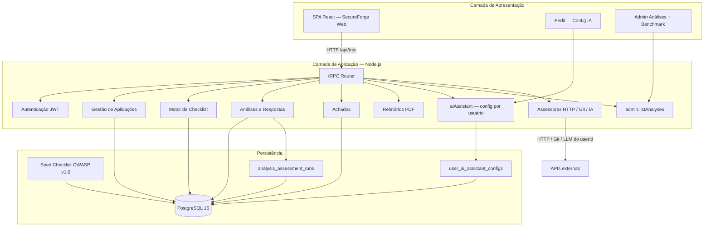
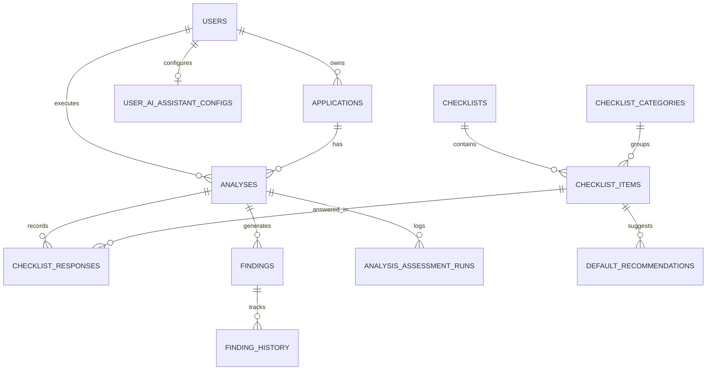
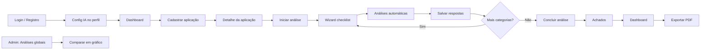

# Relatório Técnico — SecureForge Web

**Disciplina:** Projeto Integrador — Desenvolvimento de Ferramentas de Segurança Aplicada  
**Ferramenta:** SecureForge Web — *Plataforma de Diagnóstico e Hardening de Aplicações Web*  
**Codinome do projeto:** AppHardener  
**Período documentado:** 15/06/2026 — 30/06/2026  
**Versão do documento:** 4.0 (consolidado)  
**Repositório:** [github.com/secureforgeweb/secureforgeweb](https://github.com/secureforgeweb/secureforgeweb) · pacote `secureforgeweb_web`

---

## Objetivo

Este relatório consolida o planejamento, a implementação incremental e o **estado atual** da SecureForge Web: ferramenta web para **diagnóstico de segurança** e **hardening gradual** de aplicações, com checklist guiado alinhado a OWASP/ASVS, registro de achados, automação assistida (HTTP, Git, IA) e relatório PDF — sem pretensão de scanner profissional ou pentest automatizado.

A equipe demonstrou:

- Escolha consciente do foco **AppHardener** e recorte viável;
- Evolução de **planejamento** (15/06) para **base executável** (16/06) e **fluxo principal consolidado** (30/06);
- Sistema **multiusuário** com assistente IA por perfil, governança administrativa e benchmark gráfico;
- Princípio mantido em todas as etapas: a automação **sugere**, o analista **valida**, o sistema **documenta evidência**.

---

## 1. Identificação da equipe

| Campo | Informação |
|---|---|
| **Nome da equipe** | Equipe SecureForge Web |
| **Integrantes** | Josias da Silva Bentes — Analista de Banco de Dados |
| | Keven Coimbra — Analista Desenvolvedor Backend |
| | Nattan Lobato — Analista Desenvolvedor Backend |
| | Margefson Barros — Analista Frontend e Integrador |

| Integrante | Papel | Responsabilidades principais |
|---|---|---|
| **Josias da Silva Bentes** | Analista de Banco de Dados | Schema Drizzle, migrações (`0010`–`0017`), seed OWASP, scripts de banco |
| **Keven Coimbra** | Analista Desenvolvedor Backend | Routers tRPC, assessores automáticos, `aiAssistant`, validação, testes de API |
| **Nattan Lobato** | Analista Desenvolvedor Backend | Auth, RBAC, middleware, models `*.db.ts`, resolução de modelo IA por executor |
| **Margefson Barros** | Analista Frontend e Integrador | Telas React, wizard, admin benchmark, documentação, integração entre camadas |

---

## 2. Contexto e motivação

O projeto **AppHardener** orienta o desenvolvimento de ferramentas para equipes que precisam de um processo estruturado de revisão AppSec, sem recursos para scanners enterprise.

**Por que este foco?**

- Alinha-se ao perfil da equipe (desenvolvimento web full stack + banco de dados);
- Permite reaproveitar base técnica de um projeto anterior (autenticação, API, dashboard);
- Atende ao problema de equipes pequenas sem processo formal de hardening;
- Viabiliza entrega incremental com protótipo demonstrável.

**Estratégia de base:** fork adaptativo do [incident_security_system](https://github.com/margefson/incident_security_system), removendo ML/Python/SIEM e migrando o domínio de incidentes para aplicações + checklist + achados.

---

## 3. Evolução do projeto

| Aspecto | 15/06 — Planejamento | 16/06 — Base funcional | 30/06 — Consolidação |
|---|---|---|---|
| Natureza | Modelagem e arquitetura inicial | Sistema executável localmente | Núcleo operacional ponta a ponta |
| Cadastro de aplicações | Planejado (RF01) | URL **ou** repo Git obrigatório | Admin vê todas as apps |
| Checklist OWASP | Seed planejado | 24 itens / 9 categorias | Mantido + admin |
| Fluxo de análise | Descrito | Wizard com salvamento parcial | + registro de runs automáticos |
| Achados / dashboard / PDF | Fases planejadas | Implementados | Consolidados |
| Automação | Fora do MVP inicial | HTTP, Git, IA (config global) | IA **por usuário** + benchmark admin |
| Migrações Drizzle | — | `0010`–`0014` | `0015` (config IA), `0016` (runs), `0017` (evidências) |
| Assistente IA | Opcional futuro | `.env` / arquivo global | Perfil `/profile/ai-assistant` |
| Admin | Usuários + checklist | Idem | **Análises globais** + gráfico comparativo |

### Contribuição por fase (cronograma interno)

| Fase | Escopo | Status |
|---|---|---|
| F0 | Setup, rebrand, remoção ML/SIEM | Concluída |
| F1 | Aplicações + seed checklist | Concluída |
| F2 | Análise guiada + wizard | Concluída |
| F3 | Achados + recomendações | Concluída |
| F4 | Dashboard métricas + PDF | Concluída |
| F5 | Refinamento e documentação | Concluída |
| Pós-MVP | Análises HTTP, Git e assistente IA | Concluída |
| F6 | IA por usuário + admin benchmark | Concluída |

---

## 4. Foco e recorte

### 4.1 Proposta

Avaliar e melhorar a **postura de segurança** de aplicações web por meio de checklist guiado (autenticação, autorização, validação de entrada, segredos, headers, exposição de endpoints, tratamento de erros, dados sensíveis, superfície de ataque).

### 4.2 Recorte adotado

| Incluído | Excluído |
|---|---|
| Checklist guiado OWASP (24 itens, 9 categorias) | Scanner profissional / DAST completo |
| Cadastro de aplicações (URL e/ou repositório Git) | Pentest automatizado |
| Achados com severidade, status e histórico | Integração SIEM / SOC em tempo real |
| Recomendações de hardening por item | Machine Learning para classificação |
| Dashboard + relatório PDF | Análise estática profunda (SAST enterprise) |
| Análise **assistida** (HTTP, Git, IA) com revisão humana | Veredicto 100% automático |
| Assistente IA **por usuário** (OpenAI, Gemini, Azure, custom) | Configuração global única de LLM |
| Admin: visão global + benchmark gráfico de postura | Comparação de latência/custo de API |

### 4.3 Capacidades do MVP — status final

| # | Capacidade | Status |
|---|---|---|
| 1 | Cadastrar aplicação web | Concluído |
| 2 | Iniciar análise e percorrer checklist v1.0 | Concluído |
| 3 | Registrar conformidade + observações | Concluído |
| 4 | Gerar achados a partir de não conformidades | Concluído |
| 5 | Visualizar recomendações de correção | Concluído |
| 6 | Acompanhar status dos achados | Concluído |
| 7 | Consultar dashboard de postura | Concluído |
| 8 | Exportar relatório PDF | Concluído |
| 9 | Configurar assistente IA por usuário | Concluído |
| 10 | Admin: comparar análises entre operadores/modelos | Concluído |

### 4.4 Funcionando ponta a ponta

1. Login → Dashboard global  
2. **Perfil → Configurar Assistente IA** (provedor, modelo e chave por usuário)  
3. Cadastrar aplicação (URL base **ou** repositório Git)  
4. Iniciar análise → wizard com salvamento parcial e navegação livre  
5. Análises automáticas por **categoria** ou **item** (HTTP, Git, IA do usuário logado)  
6. Concluir análise → achados persistidos  
7. Gerenciar achados (status, evidências, recomendações)  
8. Dashboard de postura por aplicação  
9. Exportar PDF  
10. **Admin:** todas as análises, filtros por coluna, gráfico comparativo  

### 4.5 Limitações conhecidas e próximos passos

| Item | Situação |
|---|---|
| LLM | Requer chave válida no perfil; fallback heurístico sem API ou em HTTP 429 |
| Benchmark admin | Gráfico de **postura**; não compara latência/custo por item OWASP |
| Repositórios Git privados (SSH) | Limitado; recomendado HTTPS público |
| Metadados de sugestão IA | Aplicados no wizard via `notes`; persistência dedicada pendente |
| Vídeo demo formal | Roteiro em `DEMO.md`; gravação pendente |
| CI/CD | Scripts locais; pipeline automatizado pendente |

---

## 5. Requisitos funcionais

### 5.1 Obrigatórios

| ID | Funcionalidade | Status |
|---|---|---|
| RF01 | Cadastro de aplicação (CRUD, URL, repo Git, stack) | Concluído |
| RF02 | Checklist de análise por categorias OWASP | Concluído |
| RF03 | Registro de achados | Concluído |
| RF04 | Severidade / prioridade | Concluído |
| RF05 | Recomendação de correção | Concluído |
| RF06 | Visualização consolidada (dashboard) | Concluído |
| RF07 | Relatório simples (PDF) | Concluído |

### 5.2 Desejáveis / implementados

| ID / item | Status |
|---|---|
| RF08 — Acompanhamento de progresso dos achados | Concluído |
| RF09 — Histórico de análises | Concluído |
| RF10 — Catálogo OWASP configurável (seed + admin) | Concluído |
| RF11 — Filtros e busca de achados | Concluído |
| RF12 — Gestão de usuários (login, RBAC) | Concluído |
| Notificações in-app | Concluído |
| Admin de checklist | Concluído |
| Verificação passiva de headers HTTP | Concluído |
| Análise estática de repositório Git | Concluído |
| Assistente IA (checklist completo, por categoria/item) | Concluído |
| Assistente IA por usuário (perfil) | Concluído |
| Admin: análises globais + benchmark | Concluído |
| Registro de execuções automáticas | Concluído |

### 5.3 Análises automáticas assistidas

| Modalidade | Serviço | Itens cobertos |
|---|---|---|
| **Headers HTTP** | `checklistAssessor.ts` | HEADER-01 a 04, DATA-01 |
| **Repositório Git** | `gitRepoAssessor.ts` | AUTH, AUTHZ, INPUT, SECRET, ERROR (14 itens) |
| **Assistente IA** | `aiChecklistAssessor.ts` | Checklist completo (24 itens) — HTTP + Git + heurísticas + LLM do **usuário logado** |

Execução por categoria ou por item via `analyses.runAutoAssessment` (`itemIds`). Cada execução registrada em `analysis_assessment_runs`.

---

## 6. Arquitetura

### 6.1 Visão geral

Aplicação web **monolítica modular** em monorepo (`secureforgeweb_web/`):

- **Apresentação:** SPA React (wizard, dashboard, admin, config IA no perfil);
- **Aplicação:** Express + tRPC (routers `applications`, `analyses`, `findings`, `reports`, `aiAssistant`, `admin`);
- **Serviços:** PDF (PDFKit), assessores HTTP/Git/IA;
- **Domínio:** Aplicação → Análise → Resposta → Achado → Recomendação;
- **Persistência:** PostgreSQL 16 + Drizzle ORM + migrações versionadas.

Comunicação **type-safe** via tRPC. Catálogo OWASP carregado via seed.

### 6.2 Diagrama



### 6.3 Modelo de domínio



| Entidade | Campos principais |
|---|---|
| **applications** | `name`, `baseUrl`, `repositoryUrl`, `techStack`, `description` |
| **analyses** | `applicationId`, `userId`, `checklistId`, `status`, datas |
| **checklist_items** | `code`, `title`, `description`, `owaspRef`, `suggestedSeverity` |
| **checklist_responses** | `analysisId`, `itemId`, `compliance`, `notes` |
| **findings** | `severity`, `priority`, `status`, `evidence`, recomendações |
| **user_ai_assistant_configs** | `userId`, `provider`, `apiKey`, `model`, `baseUrl`, `enabled` |
| **analysis_assessment_runs** | `analysisId`, `userId`, `scope`, `assessmentMode`, `provider`, `assessedAt` |

**Migrações:** `0010` (aplicações e checklist) → `0014` (`repositoryUrl`) → `0015` (IA por usuário) → `0016` (runs) → `0017` (evidências por item).

### 6.4 Módulos principais

| Módulo | Responsabilidade |
|---|---|
| Gestão de Aplicações | CRUD, URL/repo Git; admin vê todas |
| Motor de Checklist | OWASP v1.0 — 9 categorias, 24 itens |
| Motor de Análises | Wizard, respostas, conclusão, runs |
| Gestão de Achados | CRUD, status, histórico, evidências |
| Motor de Recomendações | Catálogo padrão + vínculo por achado |
| Dashboard e Métricas | Score, gráficos Recharts |
| Gerador de Relatórios | `reports.exportPdf` (PDFKit) |
| Autenticação | JWT, bcrypt, RBAC |
| Assessores HTTP / Git / IA | Automação assistida com revisão humana |
| Config IA por usuário | `aiAssistantConfig.ts`, router `aiAssistant` |
| Admin Análises globais | `getAllAnalysesForAdmin`, benchmark gráfico |

### 6.5 Estrutura de diretórios

```
secureforgeweb/
├── secureforgeweb_web/
│   ├── backend/src/       # controllers, models, services, tests
│   ├── frontend/src/      # views, components, lib
│   ├── backend/drizzle/   # schema + migrações
│   ├── docs/              # documentação
│   └── scripts/           # Postgres local
└── package.json           # encaminha scripts para secureforgeweb_web/
```

---

## 7. Fluxo principal de uso



**Narrativa:** o operador autentica-se, configura (opcionalmente) o assistente IA no perfil, cadastra a aplicação, percorre o wizard com automações assistidas, revisa e salva respostas, conclui a análise, gerencia achados, consulta o dashboard e exporta PDF. O administrador compara execuções de diferentes usuários e modelos em **Análises globais**.

---

## 8. Tecnologias

| Camada | Tecnologia |
|---|---|
| Runtime | Node.js 22 |
| Linguagem | TypeScript |
| Frontend | React 19 + Vite 7 |
| UI | Tailwind 4 + shadcn/ui |
| Roteamento | Wouter |
| Backend | Express 4 + tRPC 11 |
| ORM | Drizzle ORM |
| Banco | PostgreSQL 16 |
| Autenticação | JWT + cookies HttpOnly + bcrypt |
| Validação | Joi + Zod |
| Relatórios | PDFKit |
| Gráficos | Recharts |
| Assistente IA | APIs compatíveis OpenAI (por usuário) |
| Testes | Vitest |
| Infra local | Docker Compose + pnpm |

---

## 9. Telas, execução local e evidências

### 9.1 Execução local

```powershell
cd secureforgeweb_web
pnpm install
Copy-Item .env.example .env
docker compose up -d
pnpm db:setup
pnpm dev
```

- Frontend: http://localhost:5173  
- Backend: http://localhost:3000  

### 9.2 Telas implementadas

| Tela | Rota |
|---|---|
| Landing | `/` |
| Dashboard global | `/dashboard` |
| Lista / nova aplicação | `/applications`, `/applications/new` |
| Detalhe da aplicação | `/applications/:id` |
| Wizard checklist | `/analyses/:id/checklist` |
| Dashboard da app | `/applications/:id/dashboard` |
| Achados | `/applications/:id/findings` |
| Detalhe do achado | `/findings/:id` |
| Login / Registro | `/login`, `/register` |
| Perfil | `/profile` |
| Config Assistente IA | `/profile/ai-assistant` |
| Admin usuários / checklist / análises | `/admin/users`, `/admin/checklist-items`, `/admin/analyses` |

### 9.3 Cenário multiusuário (benchmark)

1. Criar **Usuário A** e **Usuário B** com modelos IA distintos no perfil.  
2. Ambos executam análise completa no wizard.  
3. Admin em **Análises globais** seleciona execuções e **Compara** postura no gráfico.

### 9.4 Testes automatizados (domínio PosturaWeb)

| Suite | Testes |
|---|---|
| `applications.test.ts` | 10 |
| `analyses.test.ts` | 16 |
| `findings.test.ts` | 9 |
| `dashboard.test.ts` | 7 |
| `reports.test.ts` | 4 |
| `checklistAssessor.test.ts` | 9 |
| `gitRepoAssessor.test.ts` | 6 |
| `aiChecklistAssessor.test.ts` | 8 |
| `aiAssistantConfig.test.ts` | 5 |
| `security.test.ts` | 34 |

---

## 10. Ajustes de escopo ao longo do desenvolvimento

| Planejamento inicial | Evolução | Motivo |
|---|---|---|
| Análise manual apenas | Autoavaliação assistida (HTTP, Git, IA) | Usabilidade com revisão humana |
| Headers HTTP fora do MVP | Implementado | Valor demonstrável |
| URL opcional no cadastro | URL **ou** repo Git obrigatório | Contexto para automação |
| Análise global única | Por categoria e por item | Flexibilidade ao analista |
| Config IA global (`.env`) | Config **por usuário** no PostgreSQL | Múltiplos operadores |
| Admin sem visão global | Todas aplicações e análises + benchmark | Governança e comparação |
| Sem registro de execução | `analysis_assessment_runs` | Rastreabilidade |

O **problema central** (hardening guiado de aplicações web) permaneceu inalterado.

---

## 11. Documentação complementar

| Documento | Conteúdo |
|---|---|
| `PROJETO_ARQUITETURAL.md` | Arquitetura alvo e requisitos |
| `GUIA_IMPLEMENTACAO.md` | Cronograma e fases |
| `MANUAL.md` | Manual de uso |
| `DEMO.md` | Roteiro de demonstração |
| `APRESENTACAO.md` | Roteiro de slides |
| `BRAND.md` | Identidade visual e avatar GitHub |

---

## 12. Conclusão

A **SecureForge Web** atende ao perfil **AppHardener**: ferramenta **leve, guiada e orientada à correção** para diagnóstico e hardening de aplicações web. O estado atual (30/06/2026) consolida o fluxo principal ponta a ponta, suporte multiusuário com IA independente por perfil, governança administrativa e comparação visual entre operadores e modelos — evolução documentada desde o planejamento de 15/06 até a implementação completa demonstrável.

---

## Referências

- Disciplina: Projeto Integrador — Desenvolvimento de Ferramentas de Segurança Aplicada
- AppHardener (codinome do projeto)
- OWASP Application Security Verification Standard (ASVS)
- OWASP Top 10 / Cheat Sheets
- Projeto base: [incident_security_system](https://github.com/margefson/incident_security_system)
