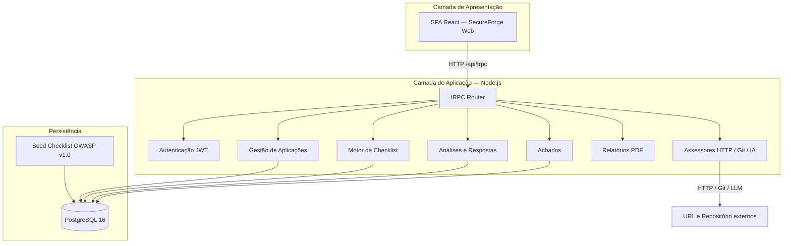
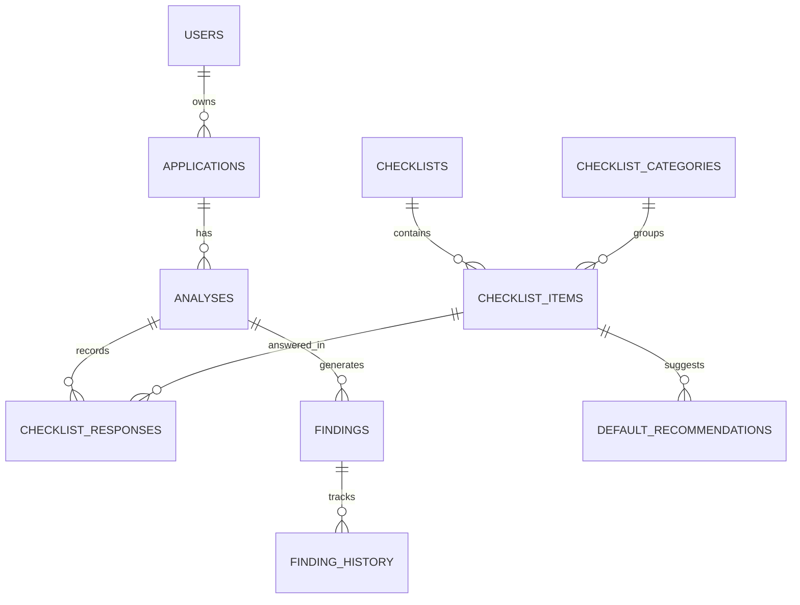
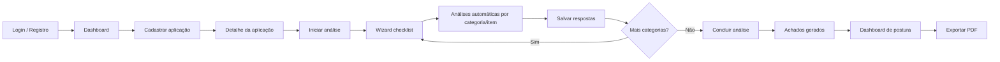

> **Documento da Entrega 2 (16/06/2026).** Para o **estado atual** após a Entrega 3, consulte [RELATORIO_ENTREGA_3.md](./RELATORIO_ENTREGA_3.md), [MANUAL.md](./MANUAL.md) e [DEMO.md](./DEMO.md).

# Relatório Técnico — Segunda Entrega

**Disciplina:** Projeto Integrador — Desenvolvimento de Ferramentas de Segurança Aplicada  
**Entrega:** Base da ferramenta e estrutura funcional mínima (Trilha 1 — AppHardener)  
**Data:** 16/06/2026  
**Versão do documento:** 2.1

---

## Objetivo desta entrega

Esta entrega demonstra que a equipe:

- Transformou o planejamento da **Entrega 1** em uma **base funcional mínima executável**;
- Implementou os componentes estruturais do sistema (persistência, módulos, fluxo de análise);
- Entrega uma ferramenta que **executa localmente** e sustenta o desenvolvimento incremental nas próximas aulas;
- Evoluiu além do mínimo exigido pela trilha, com achados, dashboard, PDF e análises automáticas assistidas (HTTP, Git e assistente IA).

> **Nota:** Esta etapa corresponde à **estruturação técnica da solução**. Em relação à [Entrega 1](./RELATORIO_ENTREGA.md) (15/06/2026), que documentou planejamento e arquitetura inicial, a presente entrega comprova a **implementação operacional** do fluxo principal e a evolução do repositório.

### Comparativo rápido — Entrega 1 × Entrega 2

| Aspecto | Entrega 1 (15/06) | Entrega 2 (16/06) |
|---|---|---|
| Natureza | Planejamento e modelagem | Base técnica implementada |
| Código | Fases 0–2 citadas como validação parcial | MVP completo + análises automáticas assistidas |
| Cadastro de aplicações | Planejado (RF01) | **Implementado** (URL ou repo Git obrigatório) |
| Checklist OWASP | Seed planejado | **24 itens / 9 categorias** em produção |
| Fluxo de análise | Descrito | **Wizard funcional** com conclusão e achados |
| Dashboard / PDF | Fases 4–5 planejadas | **Score, gráficos e exportação PDF** |
| Automação | Excluída do MVP | **Iniciada** (headers HTTP, Git, assistente IA) |

---

## 1. Identificação da equipe

| Campo | Informação |
|---|---|
| **Nome da equipe** | Equipe SecureForge Web |
| **Integrantes** | Josias da Silva Bentes — Analista de Banco de Dados |
| | Keven Coimbra — Analista Desenvolvedor Backend |
| | Nattan Lobato — Analista Desenvolvedor Backend |
| | Margefson Barros — Analista Frontend e Integrador |

---

## 2. Trilha escolhida

**AppHardener** (Trilha 1)

A trilha AppHardener orienta o desenvolvimento de ferramentas para **diagnóstico de segurança** e **hardening gradual** de aplicações web, com foco em checklist guiado, registro de achados, priorização e acompanhamento de melhorias — e não em scanners automatizados ou pentest profissional.

**Atendimento aos requisitos da Entrega 2 (Trilha 1):**

| Requisito esperado pelo AVA | Status |
|---|---|
| Cadastro de aplicações ou projetos | **Concluído** |
| Estrutura para checklist de segurança | **Concluído** |
| Estrutura para registro de achados | **Concluído** |
| Primeira versão do fluxo de análise | **Concluído** |
| Persistência dos registros | **Concluído** |
| Painel inicial ou tela principal | **Concluído** |

**Exemplo de resultado esperado pela trilha:** *O sistema já permite cadastrar uma aplicação e iniciar a avaliação de itens de segurança* — **atendido**. A equipe foi além: achados persistidos, dashboard, PDF e sugestões automáticas com revisão humana.

---

## 3. Nome da ferramenta

**SecureForge Web**  
*Plataforma de Diagnóstico e Hardening de Aplicações Web*

| Aspecto | Definição |
|---|---|
| Nome comercial / interface | **SecureForge Web** |
| Codinome acadêmico (AVA) | **AppHardener** — Trilha 1 |
| Repositório / pacote | `secureforgeweb_web` / [github.com/secureforgeweb/secureforgeweb](https://github.com/secureforgeweb/secureforgeweb) |

---

## 4. Foco da ferramenta

### 4.1 Explicação objetiva

O foco da **SecureForge Web** permanece o **hardening de aplicações web** por meio de checklist guiado alinhado a OWASP/ASVS. Na Entrega 2, esse foco foi **materializado em código executável**: cadastro de aplicações, wizard de análise, achados, dashboard, relatório PDF e análises automáticas assistidas (headers HTTP, repositório Git e assistente IA).

### 4.2 Recorte adotado pela equipe (atualizado)

| Incluído | Excluído |
|---|---|
| Checklist guiado por categorias OWASP (24 itens) | Scanner profissional de vulnerabilidades |
| Cadastro de aplicações (URL base **ou** repositório Git) | Crawling avançado / DAST completo |
| Registro de achados com severidade, status e histórico | Pentest automatizado |
| Recomendações de hardening por item | Integração SIEM / SOC em tempo real |
| Dashboard de postura + relatório PDF | Machine Learning para classificação |
| Análise **assistida** (headers HTTP, Git, IA) com revisão humana | Veredicto 100% automático sem analista |

### 4.3 Escopo mínimo viável — status de implementação (16/06/2026)

| # | Capacidade do MVP | Status |
|---|---|---|
| 1 | Cadastrar aplicação web | **Concluído** |
| 2 | Iniciar análise e percorrer checklist v1.0 | **Concluído** |
| 3 | Registrar respostas de conformidade + observações | **Concluído** |
| 4 | Gerar achados a partir de itens não conformes | **Concluído** |
| 5 | Visualizar recomendações de correção | **Concluído** |
| 6 | Acompanhar status dos achados | **Concluído** |
| 7 | Consultar dashboard de postura | **Concluído** |
| 8 | Exportar relatório PDF | **Concluído** |

**Status por fase do cronograma interno:**

| Fase | Escopo | Status |
|---|---|---|
| Fase 0 | Setup, rebrand, remoção ML/SIEM | Concluída |
| Fase 1 | Aplicações + checklist seed | Concluída |
| Fase 2 | Análise guiada + wizard | Concluída |
| Fase 3 | Achados + recomendações | Concluída |
| Fase 4 | Dashboard métricas + PDF | Concluída |
| Fase 5 | Refinamento e entrega final | Concluída |
| Análise HTTP | Headers e HTTPS (fetch passivo) | Concluída |
| Análise Git | Clone + heurísticas estáticas | Concluída |
| Assistente IA | Orquestração completa do checklist (24 itens) | Concluída |

### 4.4 O que já está funcionando / o que ainda evolui

**Funcionando ponta a ponta:**

1. Login → Dashboard global  
2. Cadastrar aplicação (validação: URL base **ou** repositório Git)  
3. Iniciar análise → wizard por categoria → **salvamento parcial** e navegação livre  
4. Análises automáticas por **categoria** ou **item**: headers HTTP, repositório Git, assistente IA  
5. Concluir análise → gerar achados  
6. Gerenciar achados (status, evidências, recomendações)  
7. Dashboard de postura por aplicação  
8. Exportar relatório PDF (dashboard global, detalhe ou dashboard da app)  

**Em evolução / limitações conhecidas:**

| Item | Situação |
|---|---|
| LLM (assistente IA) | Na E2: via `.env` global — **na E3:** config por usuário em `/profile/ai-assistant` |
| Assistente IA por item/categoria | Implementado; execuções independentes via `itemIds` |
| Salvamento parcial no wizard | Implementado; auto-save ao trocar de categoria |
| Repositórios Git privados (SSH) | Limitado; recomendado HTTPS público |
| Metadados de sugestão IA no banco | Aplicados no wizard; persistência extra não migrada |
| Testes legados (incidentes/ML do fork) | Presentes; não afetam domínio PosturaWeb |
| Vídeo demo formal | Roteiro em `DEMO.md`; gravação pendente |

---

## 5. Funcionalidades planejadas e implementadas

### 5.1 Funcionalidades obrigatórias

| ID | Funcionalidade | Descrição | Status Entrega 2 |
|---|---|---|---|
| RF01 | Cadastro de aplicação | CRUD com nome, URL, repo Git, stack e descrição | **Concluído** |
| RF02 | Checklist de análise | Formulário por categorias OWASP (wizard) | **Concluído** |
| RF03 | Registro de achados | Fragilidades documentadas na análise | **Concluído** |
| RF04 | Severidade / prioridade | Classificação crítica, alta, média, baixa | **Concluído** |
| RF05 | Recomendação de correção | Ação de hardening por achado | **Concluído** |
| RF06 | Visualização consolidada | Dashboard com score e gráficos | **Concluído** |
| RF07 | Relatório simples | Exportação PDF da postura | **Concluído** |

### 5.2 Funcionalidades desejáveis / opcionais

| ID | Funcionalidade | Status Entrega 2 |
|---|---|---|
| RF08 | Acompanhamento de progresso (status dos achados) | **Concluído** |
| RF09 | Histórico de análises | **Concluído** |
| RF10 | Catálogo OWASP configurável | **Concluído** (seed + admin) |
| RF11 | Filtros e busca de achados | **Concluído** |
| RF12 | Gestão de usuários (login, RBAC) | **Concluído** |
| — | Notificações in-app (achados críticos) | **Concluído** |
| — | Admin de checklist | **Concluído** |
| — | Verificação passiva de headers HTTP | **Concluído** |
| — | Análise estática de repositório Git | **Concluído** |
| — | Assistente IA (checklist completo, por categoria/item) | **Concluído** |

### 5.3 Análises automáticas assistidas

| Modalidade | Serviço | Itens cobertos |
|---|---|---|
| **Headers HTTP** | `checklistAssessor.ts` | HEADER-01 a 04, DATA-01 |
| **Repositório Git** | `gitRepoAssessor.ts` | AUTH, AUTHZ, INPUT, SECRET, ERROR (14 itens) |
| **Assistente IA** | `aiChecklistAssessor.ts` | Checklist completo (24 itens) — orquestra HTTP + Git + heurísticas + LLM opcional |

Execução **por categoria ou por item** via parâmetro `itemIds` no endpoint `analyses.runAutoAssessment`.

Princípio mantido: a automação **sugere**, o analista **valida**, o sistema **documenta evidência**.

---

## 6. Arquitetura inicial

### 6.1 Descrição resumida

A SecureForge Web mantém a arquitetura monolítica modular em monorepo definida na Entrega 1, agora com **todos os módulos de domínio implementados** e serviços de autoavaliação na camada de aplicação.

- **Apresentação:** SPA React (telas, wizard, dashboard, exportação PDF);
- **Aplicação:** API Express + tRPC (routers `applications`, `analyses`, `findings`, `reports`);
- **Serviços:** PDF (PDFKit), assessores HTTP, Git e assistente IA;
- **Domínio:** Aplicação → Análise → Resposta → Achado → Recomendação;
- **Persistência:** PostgreSQL 16 + Drizzle ORM + migrações `0010`–`0014`.

### 6.2 Diagrama de arquitetura



### 6.3 Modelo de domínio (visão simplificada)



**Entidades centrais e persistência:**

| Entidade | Campos principais |
|---|---|
| **applications** | `name`, `baseUrl`, `repositoryUrl`, `techStack`, `description` |
| **analyses** | `applicationId`, `checklistId`, `status`, `startedAt`, `completedAt` |
| **checklist_items** | `code`, `title`, `description`, `owaspRef`, `suggestedSeverity` |
| **checklist_responses** | `analysisId`, `itemId`, `compliance`, `notes` |
| **findings** | `severity`, `priority`, `status`, `evidence`, recomendações |
| **finding_history** | rastreamento de alterações |

**Migrações PosturaWeb:** `0010` (aplicações e checklist) → `0014` (campo `repositoryUrl`).

---

## 7. Módulos principais

| Módulo | Responsabilidade | Status |
|---|---|---|
| **Gestão de Aplicações** | CRUD, metadados, URL/repo Git, validação de cadastro | **Implementado** |
| **Motor de Checklist** | Catálogo OWASP v1.0, 9 categorias, 24 itens | **Implementado** |
| **Motor de Análises** | Wizard, respostas, progresso, conclusão | **Implementado** |
| **Gestão de Achados** | CRUD, status, histórico, evidências | **Implementado** |
| **Motor de Recomendações** | Catálogo padrão + vínculo por achado | **Implementado** |
| **Dashboard e Métricas** | Score, severidade, taxa de resolução, gráficos | **Implementado** |
| **Gerador de Relatórios** | `reports.exportPdf` — PDF de postura (PDFKit) | **Implementado** |
| **Autenticação e Autorização** | JWT, bcrypt, RBAC, isolamento por usuário | **Implementado** |
| **Assessor HTTP** | `checklistAssessor.ts` — headers e HTTPS | **Implementado** |
| **Assessor Git** | `gitRepoAssessor.ts` — clone + heurísticas | **Implementado** |
| **Assistente IA** | `aiChecklistAssessor.ts` — orquestração completa + LLM opcional | **Implementado** |

### Organização de diretórios (estrutura inicial da aplicação)

```
secureforgeweb/
├── backend/src/
│   ├── controllers/     # Routers tRPC
│   ├── models/          # *.db.ts (applications, analyses, findings…)
│   ├── services/        # pdf, checklistAssessor, gitRepoAssessor, aiChecklistAssessor
│   └── tests/           # Vitest (domínio PosturaWeb)
├── frontend/src/
│   ├── views/           # Telas (18 componentes de view)
│   └── components/      # UI, PostureMetricsPanel, DashboardLayout
├── backend/drizzle/     # Schema + migrações SQL
└── docs/                # Documentação acadêmica e operacional
```

---

## 8. Fluxo principal de uso



### Descrição narrativa do fluxo (implementado)

1. O operador autentica-se na SecureForge Web.
2. Cadastra uma aplicação informando **URL base e/ou repositório Git** (pelo menos um obrigatório).
3. Inicia uma análise de checklist na página da aplicação.
4. No wizard, executa análises automáticas **por categoria** (headers HTTP, repositório Git, assistente IA) ou **por item** (assistente IA) — sugestões com confiança e evidência, sujeitas a revisão humana.
5. Marca conformidade por item; **salva parcialmente** ou avança com categoria completa; navega livremente entre categorias.
6. O sistema **persiste achados** para itens não conformes.
7. Na lista de achados, atualiza status e consulta recomendações.
8. No **dashboard da aplicação** ou no **detalhe da aplicação**, consulta score e gráficos.
9. Clica em **Exportar PDF** para baixar o relatório de postura.

---

## 9. Tecnologias previstas

| Camada | Tecnologia | Uso na Entrega 2 |
|---|---|---|
| **Runtime** | Node.js 22 | Backend e scripts |
| **Linguagem** | TypeScript | Frontend + backend |
| **Frontend** | React 19 + Vite 7 | SPA com wizard e dashboard |
| **UI** | Tailwind 4 + shadcn/ui | Tema claro/escuro |
| **Backend** | Express 4 + tRPC 11 | API type-safe |
| **ORM** | Drizzle ORM | Schema e migrações |
| **Banco** | PostgreSQL 16 | Persistência central |
| **Autenticação** | JWT + bcrypt | Sessão e RBAC |
| **Validação** | Joi + Zod | API e formulários |
| **Relatórios** | PDFKit | `reports.exportPdf` |
| **Gráficos** | Recharts | Dashboard de postura |
| **Assistente IA** | OpenAI API (opcional) | Orquestração completa; fallback heurístico |
| **Testes** | Vitest | Suites do domínio PosturaWeb |
| **Infra local** | Docker Compose + pnpm | `pnpm dev`, `pnpm db:setup` |

---

## 10. Organização inicial da equipe

| Integrante | Papel | Responsabilidades principais |
|---|---|---|
| **Josias da Silva Bentes** | Analista de Banco de Dados | Schema Drizzle, migrações, seed OWASP, scripts de banco |
| **Keven Coimbra** | Analista Desenvolvedor Backend | Routers tRPC, assessores automáticos, validação, testes de API |
| **Nattan Lobato** | Analista Desenvolvedor Backend | Auth, RBAC, middleware, models `*.db.ts` |
| **Margefson Barros** | Analista Frontend e Integrador | Telas React, wizard, dashboard, documentação, integração |

### Contribuição por fase (realizada)

| Fase | Entregável principal |
|---|---|
| F0–F1 | Repositório limpo, aplicações, seed checklist |
| F2 | Wizard de análise e respostas |
| F3 | Achados, recomendações, histórico |
| F4–F5 | Dashboard, PDF, admin, manual e demo |
| Pós-MVP | Análises automáticas HTTP, Git e assistente IA |

---

## 11. Protótipo de telas e evidência de execução local

### 11.1 Como executar localmente

```powershell
pnpm install
Copy-Item .env.example .env
docker compose up -d
pnpm db:setup
pnpm dev
```

- Frontend: http://localhost:5173  
- Backend: http://localhost:3000  

### 11.2 Telas implementadas

| Tela | Rota | Conteúdo principal |
|---|---|---|
| Landing | `/` | Apresentação SecureForge Web |
| Dashboard global | `/dashboard` | Score agregado, lista de aplicações |
| Lista de aplicações | `/applications` | CRUD e acesso ao detalhe |
| Nova aplicação | `/applications/new` | Cadastro com URL **ou** repo Git obrigatório |
| Detalhe da aplicação | `/applications/:id` | Análise, dashboard, **Exportar PDF**, achados |
| Wizard checklist | `/analyses/:id/checklist` | 9 categorias; análises por categoria/item; salvamento parcial |
| Dashboard da app | `/applications/:id/dashboard` | Métricas, gráficos, **Exportar PDF** |
| Achados | `/applications/:id/findings` | Lista filtrável |
| Detalhe do achado | `/findings/:id` | Recomendação, status, histórico |
| Login / Registro | `/login`, `/register` | Auth com política de senha |
| Admin checklist | `/admin/checklist-items` | Gestão de itens OWASP |

### 11.3 Evidências visuais (prints / demo)

| Evidência | Descrição |
|---|---|
| Cadastro de aplicação | Formulário com URL base, repositório Git e validação |
| Wizard + Assistente IA | Badges “Sugestão IA” / “Sugestão automática”, confiança, execução por item |
| Dashboard / Exportar PDF | Score, gráficos e download do relatório |
| Fluxo completo | Demonstrável conforme `docs/DEMO.md` |

**Referência visual (local):**

- http://localhost:5173/dashboard  
- http://localhost:5173/applications/new  
- http://localhost:5173/applications/:id — botões **Ver dashboard** e **Exportar PDF**  
- http://localhost:5173/applications/:id/dashboard — botão **Exportar PDF**  
- http://localhost:5173/analyses/:id/checklist  

### 11.4 Testes automatizados (domínio PosturaWeb)

| Suite | Testes |
|---|---|
| `applications.test.ts` | 10 |
| `analyses.test.ts` | 16 |
| `findings.test.ts` | 9 |
| `dashboard.test.ts` | 7 |
| `reports.test.ts` | 4 |
| `checklistAssessor.test.ts` | 9 |
| `gitRepoAssessor.test.ts` | 6 |
| `aiChecklistAssessor.test.ts` | 8 |
| `security.test.ts` | 34 |

---

## 12. Link do repositório

| Item | Valor |
|---|---|
| **Repositório SecureForge Web** | https://github.com/secureforgeweb/secureforgeweb |
| **Entrega anterior** | [RELATORIO_ENTREGA.md](./RELATORIO_ENTREGA.md) — Entrega 1 (15/06/2026) |

Documentação complementar:

- `docs/PROJETO_ARQUITETURAL.md` — visão arquitetural
- `docs/GUIA_IMPLEMENTACAO.md` — roadmap e cronograma
- `docs/MANUAL.md` — manual de uso
- `docs/DEMO.md` — roteiro de demonstração
- `docs/BRAND.md` — identidade visual

### 12.1 Ajustes de escopo em relação à Entrega 1

| Entrega 1 | Entrega 2 | Motivo |
|---|---|---|
| Análise manual apenas | Autoavaliação assistida (HTTP, Git, IA) | Usabilidade com revisão humana |
| Headers HTTP fora do MVP | Implementado | Valor demonstrável na trilha |
| Análise estática excluída | Heurísticas Git + assistente IA integrado | Escopo controlado, não SAST profissional |
| URL opcional no cadastro | URL **ou** repo Git obrigatório | Contexto mínimo para automação |
| Análise global única | Por categoria e por item | Flexibilidade para o analista |

Não houve mudança de trilha nem de problema central.

---

## Conclusão

A **Entrega 2** cumpre os requisitos do AVA para a etapa de **base funcional mínima** da Trilha 1 — AppHardener e demonstra evolução clara em relação à Entrega 1: de planejamento para **sistema executável**, com persistência, fluxo de análise, achados, dashboard, PDF e análises automáticas assistidas (por categoria e por item).

**Próximos passos:** gravação do vídeo demo para submissão, consolidação de prints e evoluções incrementais (CI/CD, repositórios privados, persistência de metadados de sugestões IA).

---

## Referências

- [RELATORIO_ENTREGA.md](./RELATORIO_ENTREGA.md) — Entrega 1
- Disciplina: Projeto Integrador — Ferramentas de Segurança Aplicada
- Trilha 1 — AppHardener (AVA)
- OWASP ASVS / OWASP Top 10

---
