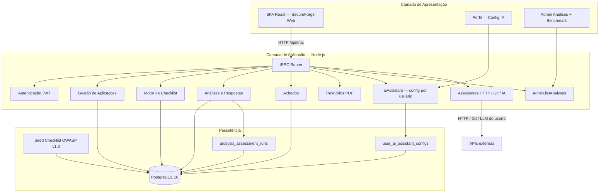
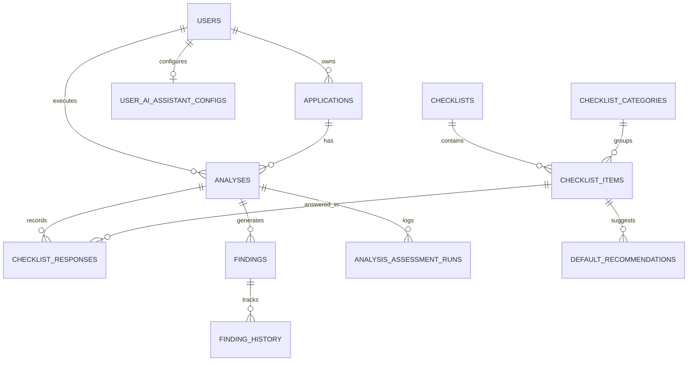
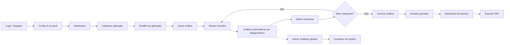

# Relatório Técnico — Terceira Entrega

**Disciplina:** Projeto Integrador — Desenvolvimento de Ferramentas de Segurança Aplicada  
**Entrega:** Fluxo principal da ferramenta e consolidação da solução (Trilha 1 — AppHardener)  
**Data:** 17/06/2026  
**Versão do documento:** 3.0

---

## Objetivo desta entrega

Esta entrega demonstra que a equipe:

- Consolidou o **núcleo funcional** da solução implementada na Entrega 2;
- Executa o **fluxo principal ponta a ponta** de forma demonstrável (cadastro → análise → achados → postura → PDF);
- Suporta **múltiplos usuários** com assistente IA **independente por perfil**;
- Oferece **governança administrativa** para visualizar todas as análises e comparar resultados entre operadores e modelos;
- Mantém o princípio da trilha: automação **assiste**, o analista **valida**, o sistema **documenta evidência**.

> **Nota:** Esta etapa corresponde à **consolidação do caso de uso central**. Em relação à [Entrega 2](./RELATORIO_ENTREGA_2.md) (16/06/2026), que entregou a base estrutural mínima, a presente entrega comprova que a ferramenta **cumpre sua proposta principal** de forma concreta e utilizável.

### Comparativo rápido — Entrega 2 × Entrega 3

| Aspecto | Entrega 2 (16/06) | Entrega 3 (30/06) |
|---|---|---|
| Natureza | Base estrutural mínima executável | **Núcleo funcional consolidado** |
| Fluxo principal | Implementado | **Demonstrável ponta a ponta** com múltiplos perfis |
| Assistente IA | Configuração global (`.env` / arquivo) | **Por usuário** (`user_ai_assistant_configs`) |
| Provedores IA | OpenAI via `.env` | OpenAI, Gemini, Azure, custom — **por conta** |
| Admin | Usuários + checklist OWASP | **+ visão global de análises** e benchmark |
| Comparação de modelos | Não prevista | **Seleção múltipla + gráfico de postura** |
| Registro de execuções | Não persistido | Tabela `analysis_assessment_runs` |
| Migrações | `0010`–`0014` | **`0015`–`0016`** |
| Perfil do usuário | Dados e senha | **+ configurar assistente IA** |

---

## 1. Identificação da equipe

| Campo | Informação |
|---|---|
| **Nome da equipe** | Equipe SecureForge Web |
| **Integrantes** | Josias da Silva Bentes — Analista de Banco de Dados |
| | Keven Coimbra — Analista Desenvolvedor Backend |
| | Nattan Lobato — Analista Desenvolvedor Backend |
| | Margefson Barros — Analista Frontend e Integrador |

---

## 2. Trilha escolhida

**AppHardener** (Trilha 1)

A trilha AppHardener orienta o desenvolvimento de ferramentas para **diagnóstico de segurança** e **hardening gradual** de aplicações web, com foco em checklist guiado, registro de achados, priorização e acompanhamento de melhorias — e não em scanners automatizados ou pentest profissional.

**Atendimento aos requisitos da Entrega 3 (AVA):**

| Requisito esperado pelo AVA | Status |
|---|---|
| Fluxo principal implementado e funcional | **Concluído** |
| Descrição objetiva do fluxo e interação do usuário | **Concluído** (seções 4 e 8) |
| Evidência de funcionamento (telas / sequência) | **Concluído** (seção 11) |
| Funcionalidades concluídas / parciais / finais | **Concluído** (seções 4.4 e 5) |
| Ajustes de escopo ou arquitetura | **Concluído** (seção 12.1) |
| Repositório atualizado com evolução em relação à E2 | **Concluído** (seção 12) |

**Exemplo de resultado esperado pela trilha:** *O sistema já permite cadastrar uma aplicação e iniciar a avaliação de itens de segurança* — **atendido e consolidado**. Na Entrega 3, o operador percorre o fluxo completo, exporta PDF e o administrador compara execuções de diferentes usuários e modelos de IA.

---

## 3. Nome da ferramenta

**SecureForge Web**  
*Plataforma de Diagnóstico e Hardening de Aplicações Web*

| Aspecto | Definição |
|---|---|
| Nome comercial / interface | **SecureForge Web** |
| Codinome acadêmico (AVA) | **AppHardener** — Trilha 1 |
| Repositório / pacote | `secureforgeweb_web` / [github.com/secureforgeweb/secureforgeweb](https://github.com/secureforgeweb/secureforgeweb) |

---

## 4. Foco da ferramenta

### 4.1 Explicação objetiva

O foco da **SecureForge Web** permanece o **hardening de aplicações web** por meio de checklist guiado alinhado a OWASP/ASVS. Na Entrega 3, esse foco foi **consolidado em fluxo operacional completo**: cada operador configura seu assistente IA, executa análises com automação assistida (HTTP, Git, IA), gera achados, acompanha postura e exporta PDF — enquanto o administrador monitora e compara resultados entre usuários e modelos.

### 4.2 Recorte adotado pela equipe (atualizado)

| Incluído | Excluído |
|---|---|
| Checklist guiado por categorias OWASP (24 itens) | Scanner profissional de vulnerabilidades |
| Cadastro de aplicações (URL base **ou** repositório Git) | Crawling avançado / DAST completo |
| Registro de achados com severidade, status e histórico | Pentest automatizado |
| Recomendações de hardening por item | Integração SIEM / SOC em tempo real |
| Dashboard de postura + relatório PDF | Machine Learning para classificação |
| Análise **assistida** (headers HTTP, Git, IA) com revisão humana | Veredicto 100% automático sem analista |
| **Assistente IA por usuário** (OpenAI, Gemini, Azure, custom) | Configuração global única de LLM |
| **Admin:** visão global de análises + benchmark gráfico | Comparação de latência/custo de API |

### 4.3 Escopo mínimo viável — status de implementação (17/06/2026)

| # | Capacidade do MVP | Status |
|---|---|---|
| 1 | Cadastrar aplicação web | **Concluído** |
| 2 | Iniciar análise e percorrer checklist v1.0 | **Concluído** |
| 3 | Registrar respostas de conformidade + observações | **Concluído** |
| 4 | Gerar achados a partir de itens não conformes | **Concluído** |
| 5 | Visualizar recomendações de correção | **Concluído** |
| 6 | Acompanhar status dos achados | **Concluído** |
| 7 | Consultar dashboard de postura | **Concluído** |
| 8 | Exportar relatório PDF | **Concluído** |
| 9 | Configurar assistente IA por usuário | **Concluído** — Entrega 3 |
| 10 | Admin: comparar análises entre operadores/modelos | **Concluído** — Entrega 3 |

**Status por fase do cronograma interno:**

| Fase | Escopo | Status |
|---|---|---|
| Fase 0 | Setup, rebrand, remoção ML/SIEM | Concluída |
| Fase 1 | Aplicações + checklist seed | Concluída |
| Fase 2 | Análise guiada + wizard | Concluída |
| Fase 3 | Achados + recomendações | Concluída |
| Fase 4 | Dashboard métricas + PDF | Concluída |
| Fase 5 | Refinamento e documentação | Concluída |
| Análise HTTP / Git / IA | Assessores automáticos | Concluída |
| **Fase 6** | IA por usuário + admin benchmark | **Concluída** — Entrega 3 |

### 4.4 O que já está funcionando / o que ainda evolui

**Funcionando ponta a ponta:**

1. Login → Dashboard global  
2. **Perfil → Configurar Assistente IA** (provedor, modelo e chave por usuário)  
3. Cadastrar aplicação (URL base **ou** repositório Git)  
4. Iniciar análise → wizard por categoria → salvamento parcial e navegação livre  
5. Análises automáticas por **categoria** ou **item**: headers HTTP, repositório Git, assistente IA (modelo do usuário logado)  
6. Concluir análise → gerar achados  
7. Gerenciar achados (status, evidências, recomendações)  
8. Dashboard de postura por aplicação  
9. Exportar relatório PDF  
10. **Admin:** visualizar todas as análises, filtrar por coluna, comparar postura em gráfico  

**Em evolução / limitações conhecidas:**

| Item | Situação |
|---|---|
| LLM (assistente IA) | Requer chave válida no perfil; fallback heurístico sem API ou em HTTP 429 |
| Benchmark admin | Gráfico de **postura**; não compara latência/custo nem métricas por item OWASP |
| Repositórios Git privados (SSH) | Limitado; recomendado HTTPS público |
| Snapshot imutável do modelo no run | Usa config atual do executor + registro em `analysis_assessment_runs` |
| Metadados de sugestão IA no banco | Aplicados no wizard via `notes`; persistência extra para entrega final |
| Vídeo demo formal | Roteiro em `DEMO.md`; gravação pendente |
| CI/CD | Scripts locais; pipeline automatizado para entrega final |

**Funcionalidades adiadas para a etapa final:**

| Funcionalidade | Motivo |
|---|---|
| Persistência dedicada de metadados de sugestão IA | Escopo da entrega final |
| Comparação avançada por categoria OWASP / severidade | Benchmark ampliado |
| Repositórios privados com token | Complexidade de credenciais |
| Notificações por e-mail | Mantido in-app apenas |
| Pentest / DAST profissional | Fora do recorte AppHardener |

---

## 5. Funcionalidades planejadas e implementadas

### 5.1 Funcionalidades obrigatórias

| ID | Funcionalidade | Descrição | Status Entrega 3 |
|---|---|---|---|
| RF01 | Cadastro de aplicação | CRUD com nome, URL, repo Git, stack e descrição | **Concluído** |
| RF02 | Checklist de análise | Formulário por categorias OWASP (wizard) | **Concluído** |
| RF03 | Registro de achados | Fragilidades documentadas na análise | **Concluído** |
| RF04 | Severidade / prioridade | Classificação crítica, alta, média, baixa | **Concluído** |
| RF05 | Recomendação de correção | Ação de hardening por achado | **Concluído** |
| RF06 | Visualização consolidada | Dashboard com score e gráficos | **Concluído** |
| RF07 | Relatório simples | Exportação PDF da postura | **Concluído** |

### 5.2 Funcionalidades desejáveis / opcionais

| ID | Funcionalidade | Status Entrega 3 |
|---|---|---|
| RF08 | Acompanhamento de progresso (status dos achados) | **Concluído** |
| RF09 | Histórico de análises | **Concluído** |
| RF10 | Catálogo OWASP configurável | **Concluído** (seed + admin) |
| RF11 | Filtros e busca de achados | **Concluído** |
| RF12 | Gestão de usuários (login, RBAC) | **Concluído** |
| — | Notificações in-app (achados críticos) | **Concluído** |
| — | Admin de checklist | **Concluído** |
| — | Verificação passiva de headers HTTP | **Concluído** |
| — | Análise estática de repositório Git | **Concluído** |
| — | Assistente IA (checklist completo, por categoria/item) | **Concluído** |
| — | **Assistente IA por usuário** (perfil) | **Concluído** — E3 |
| — | **Admin: análises globais + benchmark** | **Concluído** — E3 |
| — | **Registro de execuções automáticas** | **Concluído** — E3 |

### 5.3 Análises automáticas assistidas

| Modalidade | Serviço | Itens cobertos |
|---|---|---|
| **Headers HTTP** | `checklistAssessor.ts` | HEADER-01 a 04, DATA-01 |
| **Repositório Git** | `gitRepoAssessor.ts` | AUTH, AUTHZ, INPUT, SECRET, ERROR (14 itens) |
| **Assistente IA** | `aiChecklistAssessor.ts` | Checklist completo (24 itens) — orquestra HTTP + Git + heurísticas + LLM do **usuário logado** |

Execução **por categoria ou por item** via parâmetro `itemIds` no endpoint `analyses.runAutoAssessment`.

Cada execução é registrada em `analysis_assessment_runs` (escopo, modo, modelo, executor).

Princípio mantido: a automação **sugere**, o analista **valida**, o sistema **documenta evidência**.

---

## 6. Arquitetura inicial

### 6.1 Descrição resumida

A SecureForge Web mantém a arquitetura monolítica modular em monorepo da Entrega 2, ampliada na Entrega 3 com **configuração de IA por usuário**, **registro de execuções automáticas** e **visão administrativa global**.

- **Apresentação:** SPA React (wizard, dashboard, admin benchmark, config IA no perfil);
- **Aplicação:** API Express + tRPC (routers `applications`, `analyses`, `findings`, `reports`, `aiAssistant`, `admin`);
- **Serviços:** PDF (PDFKit), assessores HTTP, Git e assistente IA (`userId` no fluxo LLM);
- **Domínio:** Aplicação → Análise → Resposta → Achado → Recomendação;
- **Persistência:** PostgreSQL 16 + Drizzle ORM + migrações `0010`–`0016`.

### 6.2 Diagrama de arquitetura



### 6.3 Modelo de domínio (visão simplificada)



**Entidades centrais e persistência:**

| Entidade | Campos principais |
|---|---|
| **applications** | `name`, `baseUrl`, `repositoryUrl`, `techStack`, `description` |
| **analyses** | `applicationId`, `userId`, `checklistId`, `status`, `startedAt`, `completedAt` |
| **checklist_items** | `code`, `title`, `description`, `owaspRef`, `suggestedSeverity` |
| **checklist_responses** | `analysisId`, `itemId`, `compliance`, `notes` |
| **findings** | `severity`, `priority`, `status`, `evidence`, recomendações |
| **finding_history** | rastreamento de alterações |
| **user_ai_assistant_configs** | `userId`, `provider`, `apiKey`, `model`, `baseUrl`, `enabled` |
| **analysis_assessment_runs** | `analysisId`, `userId`, `scope`, `assessmentMode`, `provider`, `assessedAt` |

**Migrações PosturaWeb:** `0010` (aplicações e checklist) → `0014` (`repositoryUrl`) → `0015` (config IA por usuário) → `0016` (registro de execuções).

---

## 7. Módulos principais

| Módulo | Responsabilidade | Status |
|---|---|---|
| **Gestão de Aplicações** | CRUD, metadados, URL/repo Git; admin vê todas as apps | **Implementado** |
| **Motor de Checklist** | Catálogo OWASP v1.0, 9 categorias, 24 itens | **Implementado** |
| **Motor de Análises** | Wizard, respostas, progresso, conclusão, runs registrados | **Implementado** |
| **Gestão de Achados** | CRUD, status, histórico, evidências | **Implementado** |
| **Motor de Recomendações** | Catálogo padrão + vínculo por achado | **Implementado** |
| **Dashboard e Métricas** | Score, severidade, taxa de resolução, gráficos | **Implementado** |
| **Gerador de Relatórios** | `reports.exportPdf` — PDF de postura (PDFKit) | **Implementado** |
| **Autenticação e Autorização** | JWT, bcrypt, RBAC, isolamento por usuário | **Implementado** |
| **Assessor HTTP** | `checklistAssessor.ts` — headers e HTTPS | **Implementado** |
| **Assessor Git** | `gitRepoAssessor.ts` — clone + heurísticas | **Implementado** |
| **Assistente IA** | `aiChecklistAssessor.ts` — orquestração + LLM por `userId` | **Implementado** |
| **Config IA por usuário** | `aiAssistantConfig.ts`, router `aiAssistant` | **Implementado** — E3 |
| **Admin Análises globais** | `getAllAnalysesForAdmin`, benchmark gráfico | **Implementado** — E3 |

### Organização de diretórios (estrutura da aplicação)

```
secureforgeweb/
├── backend/src/
│   ├── controllers/     # Routers tRPC (applications, analyses, aiAssistant, admin…)
│   ├── models/          # *.db.ts (applications, analyses, userAiAssistantConfig, assessmentRuns…)
│   ├── services/        # pdf, checklistAssessor, gitRepoAssessor, aiChecklistAssessor, aiAssistantConfig
│   └── tests/           # Vitest (domínio PosturaWeb)
├── frontend/src/
│   ├── views/           # Telas (AdminAnalyses, AdminAiAssistant, wizard, dashboard…)
│   └── components/      # UI, PostureMetricsPanel, DashboardLayout
├── backend/drizzle/     # Schema + migrações SQL (0010–0016)
└── docs/                # Documentação acadêmica e operacional
```

---

## 8. Fluxo principal de uso



### Descrição narrativa do fluxo (implementado)

1. O operador autentica-se na SecureForge Web.
2. Em **Perfil → Configurar Assistente IA**, define provedor, modelo e chave **pessoais** (opcional para LLM).
3. Cadastra uma aplicação informando **URL base e/ou repositório Git** (pelo menos um obrigatório).
4. Inicia uma análise de checklist na página da aplicação.
5. No wizard, executa análises automáticas **por categoria** (headers HTTP, repositório Git, assistente IA) ou **por item** (assistente IA) — usando o modelo do usuário logado.
6. Marca conformidade por item; **salva parcialmente** ou avança com categoria completa; navega livremente entre categorias.
7. O sistema **persiste achados** para itens não conformes e **registra execuções automáticas** (`analysis_assessment_runs`).
8. Na lista de achados, atualiza status e consulta recomendações.
9. No dashboard da aplicação, consulta score e gráficos.
10. Clica em **Exportar PDF** para baixar o relatório de postura.
11. *(Admin)* Em **Análises globais**, visualiza todas as análises, filtra, seleciona 2+ execuções e **compara postura em gráfico**.

---

## 9. Tecnologias previstas

| Camada | Tecnologia | Uso na Entrega 3 |
|---|---|---|
| **Runtime** | Node.js 22 | Backend e scripts |
| **Linguagem** | TypeScript | Frontend + backend |
| **Frontend** | React 19 + Vite 7 | SPA com wizard, admin benchmark e config IA |
| **UI** | Tailwind 4 + shadcn/ui | Tema claro/escuro; tabela redimensionável |
| **Backend** | Express 4 + tRPC 11 | API type-safe (`aiAssistant`, `admin.listAnalyses`) |
| **ORM** | Drizzle ORM | Schema e migrações `0015`–`0016` |
| **Banco** | PostgreSQL 16 | Config IA e runs por usuário |
| **Autenticação** | JWT + bcrypt | Sessão e RBAC |
| **Validação** | Joi + Zod | API e formulários |
| **Relatórios** | PDFKit | `reports.exportPdf` |
| **Gráficos** | Recharts | Dashboard e comparativo admin |
| **Assistente IA** | APIs compatíveis OpenAI | Por usuário (OpenAI, Gemini, Azure, custom); fallback heurístico |
| **Testes** | Vitest | Suites do domínio PosturaWeb |
| **Infra local** | Docker Compose + pnpm | `pnpm dev`, `pnpm db:setup` |

---

## 10. Organização inicial da equipe

| Integrante | Papel | Responsabilidades principais |
|---|---|---|
| **Josias da Silva Bentes** | Analista de Banco de Dados | Schema Drizzle, migrações `0015`–`0016`, seed OWASP |
| **Keven Coimbra** | Analista Desenvolvedor Backend | Routers `aiAssistant`, `admin.listAnalyses`, assessores |
| **Nattan Lobato** | Analista Desenvolvedor Backend | Auth multiusuário, `resolveExecutorAiModel`, models `*.db.ts` |
| **Margefson Barros** | Analista Frontend e Integrador | `AdminAnalyses`, config IA no perfil, documentação, integração |

### Contribuição por fase (realizada)

| Fase | Entregável principal |
|---|---|
| F0–F1 | Repositório limpo, aplicações, seed checklist |
| F2 | Wizard de análise e respostas |
| F3 | Achados, recomendações, histórico |
| F4–F5 | Dashboard, PDF, admin, manual e demo |
| Pós-MVP (E2) | Análises automáticas HTTP, Git e assistente IA |
| **Fase 6 (E3)** | IA por usuário, admin benchmark, `RELATORIO_ENTREGA_3.md` |

---

## 11. Protótipo de telas e evidência de execução local

### 11.1 Como executar localmente

```powershell
pnpm install
Copy-Item .env.example .env
docker compose up -d
pnpm db:setup
pnpm dev
```

- Frontend: http://localhost:5173  
- Backend: http://localhost:3000  

### 11.2 Telas implementadas

| Tela | Rota | Conteúdo principal |
|---|---|---|
| Landing | `/` | Apresentação SecureForge Web |
| Dashboard global | `/dashboard` | Score agregado, lista de aplicações |
| Lista de aplicações | `/applications` | CRUD; admin vê todas com dono |
| Nova aplicação | `/applications/new` | Cadastro com URL **ou** repo Git obrigatório |
| Detalhe da aplicação | `/applications/:id` | Análise, histórico, **Exportar PDF**, achados |
| Wizard checklist | `/analyses/:id/checklist` | 9 categorias; análises por categoria/item |
| Dashboard da app | `/applications/:id/dashboard` | Métricas, gráficos, **Exportar PDF** |
| Achados | `/applications/:id/findings` | Lista filtrável |
| Detalhe do achado | `/findings/:id` | Recomendação, status, histórico |
| Login / Registro | `/login`, `/register` | Auth com política de senha |
| Perfil | `/profile` | Dados da conta |
| **Config Assistente IA** | `/profile/ai-assistant` | Provedor, modelo e chave **por usuário** |
| Admin usuários | `/admin/users` | Gestão de papéis |
| Admin checklist | `/admin/checklist-items` | Gestão de itens OWASP |
| **Análises globais** | `/admin/analyses` | Todas as análises, filtros, gráfico comparativo |

### 11.3 Evidências visuais (prints / demo)

| Evidência | Descrição |
|---|---|
| Config IA no perfil | Dois usuários com provedores/modelos distintos |
| Wizard + Assistente IA | Badges “Sugestão IA” / “Sugestão automática”, execução por item |
| Dashboard / Exportar PDF | Score, gráficos e download do relatório |
| Admin — coluna Modelo IA | `Google Gemini (gemini-2.0-flash)` vs `OpenAI (GPT) (gpt-4o-mini)` |
| Gráfico comparativo | Seleção de 2+ análises → barras de postura (%) |
| Fluxo completo | Demonstrável conforme `docs/DEMO.md` |

**Referência visual (local):**

- http://localhost:5173/profile/ai-assistant  
- http://localhost:5173/applications/new  
- http://localhost:5173/analyses/:id/checklist  
- http://localhost:5173/applications/:id/dashboard  
- http://localhost:5173/admin/analyses  

### 11.4 Testes automatizados (domínio PosturaWeb)

| Suite | Testes |
|---|---|
| `applications.test.ts` | 10 |
| `analyses.test.ts` | 16 |
| `findings.test.ts` | 9 |
| `dashboard.test.ts` | 7 |
| `reports.test.ts` | 4 |
| `checklistAssessor.test.ts` | 9 |
| `gitRepoAssessor.test.ts` | 6 |
| `aiChecklistAssessor.test.ts` | 8 |
| `aiAssistantConfig.test.ts` | 5 |
| `security.test.ts` | 34 |

### 11.5 Cenário multiusuário (benchmark)

1. Criar **Usuário A** e **Usuário B** com modelos IA diferentes no perfil.
2. Ambos cadastram aplicação e executam análise completa no wizard.
3. Admin acessa **Análises globais** → seleciona as análises → **Comparar**.
4. Evidenciar gráfico de postura e coluna **Modelo IA**.

---

## 12. Link do repositório

| Item | Valor |
|---|---|
| **Repositório SecureForge Web** | https://github.com/secureforgeweb/secureforgeweb |
| **Entrega anterior** | [RELATORIO_ENTREGA_2.md](./RELATORIO_ENTREGA_2.md) — Entrega 2 (16/06/2026) |
| **Entrega 1** | [RELATORIO_ENTREGA.md](./RELATORIO_ENTREGA.md) — Planejamento (15/06/2026) |

Documentação complementar:

- `docs/PROJETO_ARQUITETURAL.md` — visão arquitetural
- `docs/GUIA_IMPLEMENTACAO.md` — roadmap e cronograma
- `docs/MANUAL.md` — manual de uso
- `docs/DEMO.md` — roteiro de demonstração
- `docs/APRESENTACAO.md` — roteiro de slides
- `docs/BRAND.md` — identidade visual

### 12.1 Ajustes de escopo em relação à Entrega 2

| Entrega 2 | Entrega 3 | Motivo |
|---|---|---|
| Config IA global (`.env` / arquivo) | Config **por usuário** no PostgreSQL | Múltiplos operadores com modelos distintos |
| Um modelo LLM para todos | `userId` em todo fluxo do assistente | Isolamento por conta |
| Admin vê só apps próprios | Admin vê **todas** aplicações e análises | Governança e benchmark |
| Sem registro de execução | `analysis_assessment_runs` | Rastreabilidade e comparação |
| Modelo exibido como `heuristic-local` | Modelo **cadastrado do executor** | Clareza na coluna Modelo IA |
| Config IA só em rota admin | **Perfil** de qualquer usuário | Fluxo principal multiusuário |
| Tabela admin simples | Filtros por coluna + resize + gráfico | Usabilidade para banca |

Não houve mudança de trilha nem de problema central.

---

## Conclusão

A **Entrega 3** cumpre os requisitos do AVA para a etapa de **fluxo principal e consolidação da solução** da Trilha 1 — AppHardener e demonstra evolução clara em relação à Entrega 2: de base estrutural mínima para **núcleo funcional operacional**, com fluxo ponta a ponta, assistente IA por usuário, governança administrativa e comparação visual de resultados entre operadores e modelos.

**Próximos passos:** gravação do vídeo demo para submissão, prints do benchmark multiusuário, persistência de metadados de sugestões IA, CI/CD e funcionalidades diferenciais da entrega final.

---

## Referências

- [RELATORIO_ENTREGA_2.md](./RELATORIO_ENTREGA_2.md) — Entrega 2
- [RELATORIO_ENTREGA.md](./RELATORIO_ENTREGA.md) — Entrega 1
- Disciplina: Projeto Integrador — Ferramentas de Segurança Aplicada
- Trilha 1 — AppHardener (AVA)
- OWASP ASVS / OWASP Top 10

---
